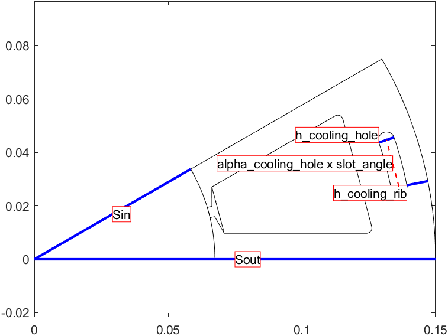

# Summary for: **Standard**  < [Stator](Stator.html)

## Class summary

Standard methods:
Standard - is a class.
create_geometry - Standard/create_geometry is a function.

## Properties

### .Standard/**conductors** is a property.

## Methods

Class methods are listed below. Inherited methods are not included.

### .**Standard**/Standard is a constructor.
this = Standard(dim)
Documentation for Standard/Standard
doc Standard

