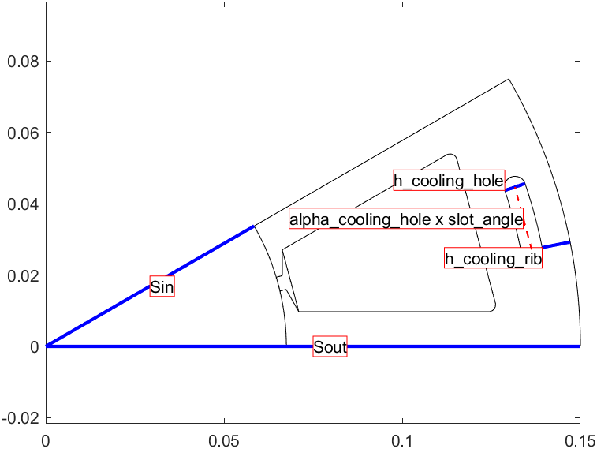

# Summary for: **Stator**  < [StatorBase](StatorBase.html) & [LayoutCompatible](LayoutCompatible.html)

## Class summary

Stator General-purpose stator class for symmetric slotted stators.

DIMENSIONS:

Main dimensions:
* Sin : airgap radius (m)
* Sout : yoke-side radius (m)
* leff : effective core length
* delta : airgap length
* symmetry_sectors : number of symmetry sectors for model

Slot dimensions:
* Any dimensions used by [Slot1](Slot1.html) (default slot shape class)
* (OPTIONAL): stator_slot : a [SlotShapeBase](SlotShapeBase.html) object or a handle to the class. Default: Slot1
* Any dimensions used by the custom slot shape class.

Materials (names, indices, or Material objects):
* stator_core_material
* stator_wedge_material : slot-opening material
* stator_stacking_factor : core stacking factor, normally between 0 and 1.

Winding specifications:
* stator_winding : a PolyphaseWindingSpec object

(OPTIONAL) Cooling channel dimensions (one channel per slot pitch):
* alpha_cooling_hole : cooling channel pitch (of slot pitch)
* h_cooling_hole : cooling channel height (measured radially)
* h_cooling_rib : thickness of rib between cooling hole and yoke boundary

(OPTIONAL): Mesh density parameters:
* lcar_core_s : Characteristic length for the core.

## Properties

### .**slot** - SlotShapeBase object

## Methods

Class methods are listed below. Inherited methods are not included.

### .Stator/**create_geometry_backup** is an undocumented builtin Stator method.

