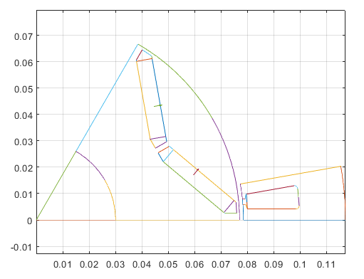
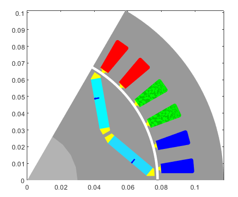
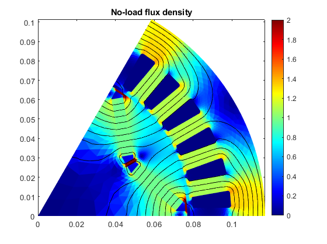
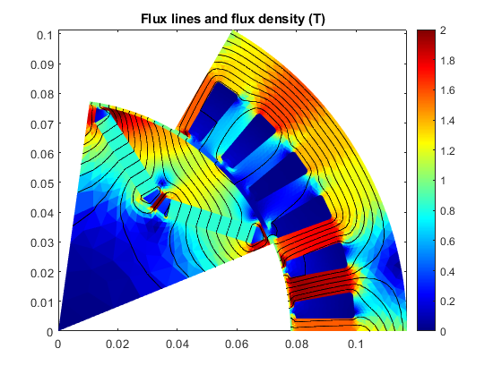
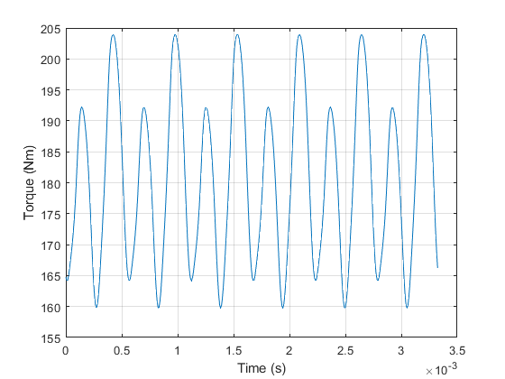
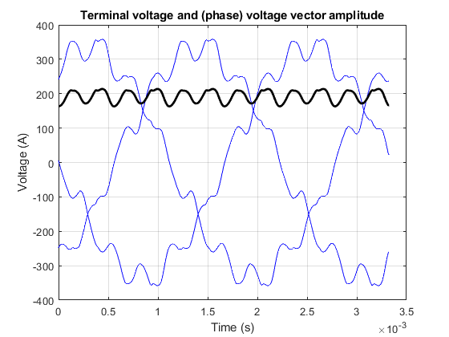

# EMDtool briefly

So, are you wondering how EMDtool works in practice? After reading this page you'll have an idea.

## Analysis workflow

A typical analysis workflow is described below.

### Creating a model

#### Dimensions and parameters for Geometry Templates

First of all, you'll be using *geometry templates* the majority of the time. A geometry template is a ´Matlab class´, representing a parametric component of your model. For instance, the [Stator](../api/Stator.html)
is a rather general-purpose template of a slotted stator. And, the [SPM1](../api/SPM1.html) template represents a surface-PM rotor with or without a rotor retaining sleeve, eddy-current shield, regular or Halbach
array magnets, segmented magnets, arced or regular magnet faces, and so forth.

In other words, there's no beating a good template in terms of ease of use, or code reusability for that matter. `EMDtool` already offers a quite decent selection of templates, and creating your own
is not such a formidable task once you get the hang of it ([please see here](..//documentation/knowledge_base/geometry_creation) and follow the breadcrumbs to get started). 
Besides, the initial investment of time here quickly pays itself back.

Anyways, creating a templated model is simple. You simply create a [`struct`](https://www.mathworks.com/help/matlab/ref/struct.html), and assign into it (as `fields`) the parameters and dimensions required. These typically include

* stator and rotor temperature (`.temperature_stator` and `.temperature_rotor`) respectively. In the future, it might be possible to change these later on, but for now they are simple hardcoded dimensions
specified in advance

* stack length `.leff`

* Any other geometric dimensions (think number of pole-pairs, stator OD and ID, rotor magnet pitch)

* Materials used: either indices to default built-in materials, or custom [Material](../api/MaterialBase.html) objects either returned by say the [PMlibrary](../api/PMlibrary.html) 
or [SteelLibrary](../api/SteelLibrary.html) classes or custom-made by you.

* Specifications for polyphase circuits: such as number of turns, layers, parallel paths, phases, etc... A [winding specification class](../api/PolyphaseWindingSpec.html) is what you'll need here.

#### Creating the geometries

Once you have the dimensions set (say in a structure called `dim`), you'll instantiate your geometry templates. Typically, you'll also visualize them to make sure everything is working correctly.

Here's how it can look like - code and plot directly from the EMDtool examples:

```matlab
stator = Stator(dim);
rotor = VIPM1(dim);

%plotting geometries
figure(1); clf; hold on; box on; axis equal;
stator.plot_geometry();
rotor.plot_geometry();
```



#### Creating a model

Next, your templates are meshed.

```matlab
stator.mesh_geometry();
rotor.mesh_geometry();
```

Finally, your newly-meshed templates are added and bound to a Model. Most users will only be using the simple [RFmodel](../api/RFmodel.html) class - a simple class for radial-flux machines.

Here's how it works - again from the included Examples.

```matlab
motor = RFmodel(dim, stator, rotor);

figure(2); clf; hold on; box on; axis equal;
motor.visualize('plot_axial', false);
```



**Note:** It doesn't have to end here - the [RFmodel](../api/RFmodel.html) class and its parent [MotorModelBase](../api/MotorModelBase.m) also support some other things, like adding more components
beside a single stator and rotor. A semi-common example would be an outrunner motor, with a stationary aluminum frame outside the rotor. One must be careful for eddy losses in such a case, after all!

### Running some simple analysis

#### Creating a problem

The next step is running some analysis. This begins by creating a [`MagneticsProblem`](../api/MagneticsProblem.html) object.

```matlab
problem = MagneticsProblem(motor);
```

Like it name sugggests, this class represents a magnetics problem, and contains several methods to solve itself, in a manner of speaking.

#### Setting some excitation

Those familiar with finite-element analysis know that a problem needs some boundary conditions to be solvable. `EMDtool` handles the actual boundary conditions automatically (in typical problems at least),
but you must still specify what kind of excitation is used.

For a very simple example, let's solve the no-load flux density of our IPM motor model created earlier. We'll use static analysis (and ignore e.g. magnet eddy currents) and only solve it for a single rotor position.
In this case, we'll set an all-zero current density into the stator winding:

```matlab
phase_circuit = stator.winding;
phase_circuit.set_source('uniform coil current', zeros(stator.winding_spec.phases, 1));
```

#### Setting some parameters

Moreover, we'll need to specify some [`parameters`](../api/SimulationParameters.html) for our `problem`. These can include the supply frequency, number of time-steps per electrical period and the number of periods
to analyse, whether or not to print the progress in the command window, and so on.

In our simply example, we'll simply specify the rotor angle:

```matlab
pars = SimulationParameters('rotorAngle', 0);
```

#### Solving the problem

Finally, we are ready to solve our problem! Here's how it goes:

```matlab
static_solution = problem.solve_static(pars);
```

Simple enough, right? The `solve_static` method solves the `problem` using _static_ analysis, i.e. ignoring all eddy currents and induced voltages. (We _can_ post-process e.g. phase or terminal voltages from a
static solution too - we simply can't have them influence the current waveforms without re-computing the solution.)

The method returns a [`StaticSolution`](../api/StaticSolution.html) object, which again does exactly what its name suggests.

#### Visualizing the solution

As we have only solved a static no-load problem without motion or any excitation, there isn't too much to do with it. But, we can always ~create some nice figures for the management~ evaluate our no-load behaviour.

```matlab
figure(5); clf; hold on; box on;
motor.plot_flux(static_solution);
title('No-load flux density');
```




### Running some more complex analysis

Now, let's do something a little more complex. We'll solve the same problem using fully transient time-stepping analysis. We'll specify the net terminal currents, but let everything else be solved according
to the circuit (and other constitutive) equations:

```matlab
%interesting circuits
phase_circuit = stator.winding;
spec = stator.winding_spec;

%setting parameters
pars = SimulationParameters('f', rpm/60*dim.p, 'isDC', true, 'N_periods', 1, ...
    'N_stepsPerPeriod', 400, 'silent', false);

%setting a current source
Is = spec.xy([id; iq], 2*pi*pars.f*pars.ts()); %(id,iq) to phase quantities
phase_circuit.set_source('terminal current source', Is);
```

Then, we'll solve the problem in the frequency-domain first to get some initial conditions, and then run time-stepping analysis for one electrical period.

```matlab
%solving harmonic
harmonic_solution = problem.solve_quasistatic(pars);

%solving stepping
stepping_solution = problem.solve_stepping(pars);
```

### Analysing the results

After a moment (usually between low tens of seconds to some minutes, depending on the model size), we'll have our results. Now let's do something with them.

For instance, the typical user looking for purely numerical data should be perfectly fine with the `results_summary` returned by the `motor` model.

```matlab
summary = motor.results_summary(stepping_solution, 'verbose', true);
```

The `.results_summary` method returns a rather colossal `structure`, and with the `verbose` option also prints the summary to the command prompt for some at-glance evaluation of 
the results:

```
Summary of results: 
 rpm : 6000
 torque_waveform : (array)
 torque_mean : 180.8283
 shaft_power : 113617.768
 efficiency : 0.97509
 total_losses : 2902.7222
 input_power_from_power_balance : 116520.4902
 input_power_from_terminal_waveforms : 115551.3129
**********************************************************
phase_circuit_data:
 input_power : 115551.3129
 input_power_waveform : (array)
 apparent_input_power : 133530.7152
 displacement_power_factor : 0.87787
 I_phase_waveform : (array)
 I_phase_dq : -225.5573      398.6571
 I_phase_rms : 323.8854
 I_terminal_waveform : (array)
 I_terminal_rms : 323.8854
 U_phase_waveform : (array)
 U_phase_induced : (array)
 U_phase_dq : -162.6688      101.1975
 U_phase_rms : 136.3425
 U_terminal_waveform : (array)
 U_terminal_rms : 236.1521
 coil_current_density_rms : 11317778.1767
**********************************************************
 total_iron_losses : 1005.2843
**********************************************************
iron_loss_data:
 P_total : 1005.2843
 P_total_time : (array)
 P_hysteresis : 620.7535
 P_rotor : 102.5572
 P_hysteresis_rotor : 72.5448
 P_eddy_rotor : 30.0124
 P_eddy : 384.5308
 P_excess : 0
 p_hysteresis_elementwise : (array)
 p_eddy_elementwise : (array)
 p_excess_elementwise : (array)
**********************************************************
 total_circuit_losses : 1897.4379
 total_Phasewinding_losses : 1886.9455
**********************************************************
Phasewinding_loss_data:
 mean_total_losses : 1886.9455
 mean_AC_losses : 0
 mean_DC_losses : 1886.9455
**********************************************************
 total_Magnets_losses : 10.4924
**********************************************************
Magnets_loss_data:
 mean_losses_per_conductor : 4.8488      5.6436
 conductor_loss_waveform : (array)
**********************************************************
 total_Shaft_losses : 1.1607e-05
**********************************************************
Shaft_loss_data:
 mean_losses_per_conductor : 1.1607e-05
 conductor_loss_waveform : (array)
**********************************************************
```

But then again, we humans are just great at interpreting visual data, so here are some examples of what we can do.

We can, for instance, plot the flux density at load on time-step no. 75, as well as our torque waveform:

```matlab
figure(5); clf; hold on; box on;
motor.plot_flux( stepping_solution, 75 );

%plotting torque
T = motor.compute_torque(stepping_solution);
plot(stepping_solution.ts, T);
xlabel('Time (s)');
ylabel('Torque (Nm)');
```




Or, we can plot both the line-to-line voltage waveforms as well as the amplitude of the (phase) voltage space vector:

```matlab
%plotting voltage and voltage space vector
E = phase_circuit.terminal_voltage(stepping_solution);
Edq = phase_circuit.phase_voltage(stepping_solution, 'output', 'space vector');
Edq_norm = colnorm( Edq );

figure(7); clf; hold on; box on; grid on;
plot(stepping_solution.ts, E', 'b');
plot(stepping_solution.ts, Edq_norm, 'k', 'linewidth', 2);
xlabel('Time (s)');
ylabel('Voltage (A)');
title('Terminal voltage and (phase) voltage vector amplitude');
```



# Common questions

## What else can I do?

## Why templates?

## Why the different levels of abstraction?