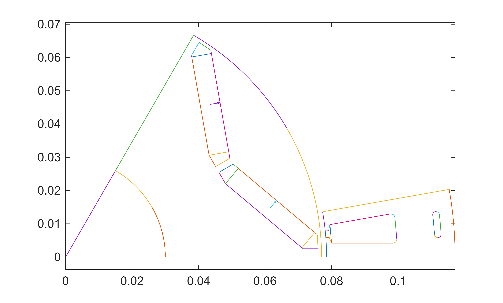
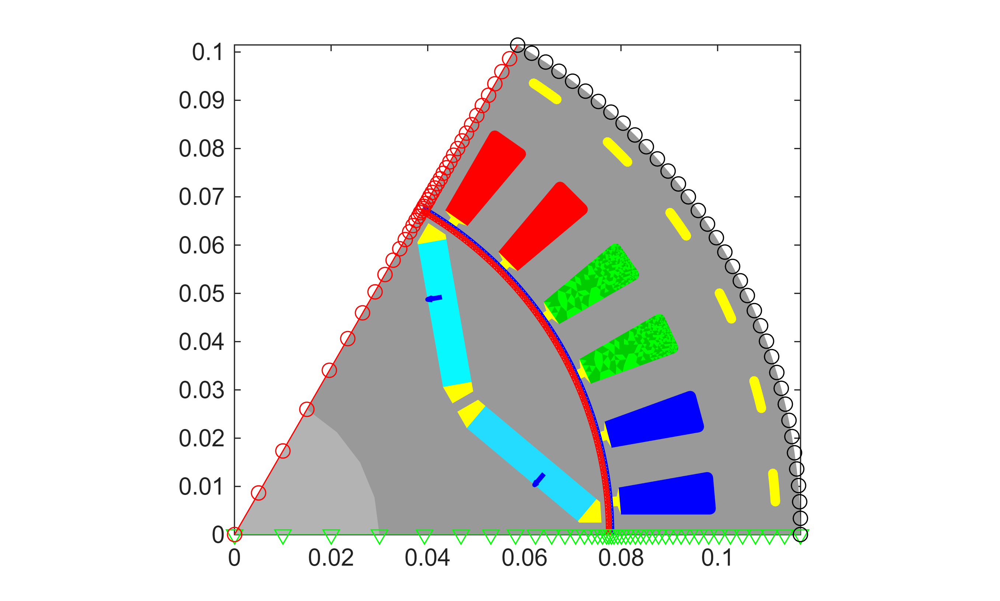

# Example 1

This script demonstrates setting up a basic up your very first EMDtool model. The general philosophy of EMDtool is based on templates \- parametric geometry classes for stators and rotors (and sometimes frames, flux modulators, and other more exotic components) that can be mixed and matched as you like under a single model.


*Granted, there are exceptions, like importing a DXF file, or manually creating an on\-off geometry with no reusability in mind. But, those are indeed exceptions \- the assumed workflow is based on maximal reusability.*


This example is organized as follows. First, the dimensions are all stored inside a single Matlab structure. Next, a stator object and a rotor object are created. Finally, an object is created to represent a radial flux motor (or generator).


Let's begin.

# Setting some dimensions
## General dimensions

We begin by creating an empty struct. 


Next, we define some general dimensions that will be used during various stages of the simulation process.

```matlab
dim = struct();

dim.p = 3; %number of pole-pairs
dim.symmetry_sectors = dim.p*2; %number of model symmetry sectors
dim.delta = 1.5e-3; %airgap length
dim.leff = 150e-3; %stack length, or active length in general

dim.temperature_stator = 120; %stator temperature
dim.temperature_rotor = 120; %rotor temperature
```
## Stator dimensions

Next, we will define some dimensions specifically for our would\-be stator. We will be using the [Stator](https://www.emdtool.com/api/Stator.html) template \- a very general\-purpose stator template. To know what dimensions are needed, you could check the online documentation, or type 'help Stator' in the Matlab command prompt.


We begin by defining some very high\-level sizing variables. These are not needed, strictly speaking, but setting up your script like this can be handy if you wish to explore a large design space manually, while having most of the required changes handled automatically.

```matlab
PHASES = 3;
SLOTS_PER_POLE_AND_PHASE = 2;
AIRGAP_FLUX_DENSITY_FOR_SIZING = 1;
```

First, we compute the number of slots:

```matlab
dim.Qs = PHASES * 2*dim.p * SLOTS_PER_POLE_AND_PHASE;
```

Next, we will define a winding specification object. These are subclasses of the [PolyphaseWindingSpec](https://www.emdtool.com/api/PolyphaseWindingSpec.html) class, and take care of several important aspects:

-  Defining the winding layout in engineering terms 
-  Defining the .xy and .dq methods for moving between the synchronous frame and instantaneous phase currents 
-  Specifying if the winding is modelled as infinitely stranded or as solid massive conductors 
-  Specifying the number, shape, type, etc of the conductors used 
-  Computing and returning several winding quantities of interest like the number of series\-turns per phase 

Since we want our machine to have a distributed winding scheme, we use the [DistributedWindingSpec](https://www.emdtool.com/api/DistributedWindingSpec.html) subclass. Finally, we assign the object to *dim.stator\_winding*.

```matlab
winding = DistributedWindingSpec(dim);
winding.N_layers = 1;
winding.N_series = 12;
winding.phases = PHASES;
winding.a = dim.p*2;
dim.stator_winding = winding;
```

Next, we define the inner and outer radius of the stator. Again, we have included some hard\-coded logic to handle different pole counts.

```matlab
%inner and outer diameter
dim.Sin = 157e-3/2; %inner radius of stator
if dim.p == 1
    dim.Sout = dim.Sin / 0.5;
elseif dim.p == 2
    dim.Sout = dim.Sin / 0.6;
else
    %very rough
    dim.Sout = dim.Sin / 0.67;
end
```

Next, we begin defining some slot dimensions. Specifically, these are not seen by the Stator class itself. Instead, we *could* have specified a  *stator\_slot* dimension, to use a specific [StatorSlotShape](https://www.emdtool.com/api/StatorSlotShape.html) object. Since we have not specified any, the general\-purpose [Slot1](https://www.emdtool.com/api/Slot1.html) is used instead.

-  The recommended approach of working with EMDtool is to use the [Slot\-Layout workflow](https://www.emdtool.com/documentation/templates/slots_and_layouts.html#slots-and-layouts). This allows dropping in different slot shapes to an existing parent geometry, and/or different conductor layouts into an existing slot geometry. While it can make things more complex to implement and understand, and even hinder analysing some edge cases, it tends to make 98 % of all analysis cases significantly easier. 

```matlab
%slot opening and bottom specs
dim.htt_taper_s = 1e-3; %slot opening, straight part before taper
dim.htt_s = 1.5e-3;
dim.wso_s = 2e-3;
dim.r_slotbottom_s = 1.2e-3;

%yoke height
hys = 2*pi*dim.Sin / (2*dim.p) * AIRGAP_FLUX_DENSITY_FOR_SIZING * 2/pi / 2 / 1.5;
dim.hslot_s = abs(dim.Sout - dim.Sin) - hys;
dim.wtooth_s = 2*pi*(dim.Sin + dim.htt_s)/dim.Qs * 0.6;
```

Next, we demonstrate an optional cooling hole feature of the Stator class.

```matlab
%adding cooling holes to the yoke just because
dim.alpha_cooling_hole = 0.3;
dim.h_cooling_hole = 2e-3;
dim.h_cooling_rib = 4e-3;
```

Finally, we define some materials. Specifically, we use the [SteelLibrary](https://www.emdtool.com/api/SteelLibrary.html) class to access the built\-in Materials library of EMDtool.

-  The SteelLibrary will return an object of the basic [Material](https://www.emdtool.com/api/Material.html) class. While this class is rather powerful and general purpose, special classes such as the [HystereticMaterial](https://www.emdtool.com/api/HystereticMaterial.html) and [DemagMaterial1](https://www.emdtool.com/api/DemagMaterial1.html) do exist. 
-  Important: Most geometry templates create local copies of the materials given as inputs. In other words, none of the materials in  *stator.materials* will be the same object as the one set into *dim.stator\_core\_material*. Importantly, changing the material properties of the here\-created object  **after** the stator object has been created will have **no effect** on the simulation results. 
-  For common questions on defining new materials, please [see the documentation page](https://www.emdtool.com/documentation/knowledge_base/defining_materials.html).
 
```matlab
%materials
dim.stator_core_material = SteelLibrary.create('M270-35A');
dim.stator_stacking_factor = 1;
dim.stator_wedge_material = 0;

```
## Rotor dimensions

Next, we move onto the rotor dimensions. In some cases, there can be a naming overlap between two dimensions, in which case we could define a different dimensions script for the rotor. Here, as in 98 % of all cases, using the same script suffices.


We will be using the [VIPM1](https://www.emdtool.com/api/VIPM1.html) class, a simple but powerful template of a V\-type IPM motor.


We first define the main dimensions

```matlab
dim.Rout = dim.Sin - dim.delta; %outer radius
dim.Rin = 30e-3; %inner or shaft radius
```

followed by the magnet size and angle.

```matlab
dim.w_mag = 30e-3; %magnet width
dim.h_mag = 6e-3; %magnet height
dim.angle_mag = pi/180 * 20; %V-opening angle in radians
```

Next, we define the desired thicknesses of the iron bridges:

```matlab
dim.w_bridge_interpole = 5e-3; %thickness of the bridge between adjacent poles
dim.w_bridge_center = 2e-3; %bridge between magnets
dim.w_bridge_out = 1e-3; %outer bridge
```

and some sizes for the air\-pockets:

```matlab
dim.w_pocket_in = 2e-3;
dim.w_pocket_out = 1e-3;
```

Finally, we define the materials used. For the core, we use the same material as for the stator core. For the magnet material, we use the (linear) material created by the [PMlibrary](https://www.emdtool.com/api/PMlibrary.html) class.

```matlab
dim.magnet_material = PMlibrary.create('N42SH');
dim.rotor_core_material = dim.stator_core_material;
dim.shaft_material = 1;
```
# Creating geometries and a model

Now, we have all dimensions set, and we can set up some geometries and a model to use.

## Geometries and visualization

We begin by creating the *geometries* \- instances of the desired template classes, and then visualizing them.

```matlab
stator = Stator(dim);
rotor = VIPM1(dim);

%plotting geometries
figure(1); clf; hold on; box on; axis equal;
stator.plot_geometry();
rotor.plot_geometry();
```



When defining the geometries for the first time, it is a good idea to temporarily end the script here, either by a breakpoint or a return statement. The human eye is a wonderful tool, and a designer with a bit of experience can often *see* if a geometry looks correct.


For automatic checking, we can call the built\-in feasibility checks. These are not foolproof, but haven't so far failed the author nonetheless:

```matlab
assert(stator.check_feasibility(), 'Stator seems invalid.')
assert(rotor.check_feasibility(), 'Rotor seems invalid.')
```

Finally, a note on an important EMDtool feature: the geometry objects commonly only describe the minimal symmetric region, such as a slot or a pole\-pitch. Special cases (such as less\-symmetric distribution of stator cooling channels) may require the minimal region being larger \- this is indeed possible in EMDtool but somewhat less common. Please contact support if this is of interest.

## Model and visualization

Finally, we create an [RFmodel](https://www.emdtool.com/api/RFmodel.html) object to represent our radial flux machine. This class, being a subclass of the [MotorModelBase](https://www.emdtool.com/api/MotorModelBase.html) encapsulates a large amount of functionality required, including computing the torque produced and assembling a general simulation results summary.

```matlab
motor = RFmodel(dim, stator, rotor);
```

```matlabTextOutput
gmsh path E:\Software\Work\gmsh-4.11.1\ loaded from preference group 'emdtool' 
```

For now, we suffice ourselves with the visualization capabilities:

```matlab
figure(2); clf; hold on; box on; axis equal;
motor.visualize('plot_axial', false, 'plot_ag', true, 'plot_nodes', true);
```



Please note that we normally wouldn't plot the boundary nodes (periodic and Dirichlet/flux insulation) or the airgap mesh for any 'finished' model \- however they are useful in the initial stage for verifying that everything works correctly. This is doubly useful for those implementing [templates of your own](https://www.emdtool.com/documentation/templates/geometry_creation.html).


Before concluding this example, below are some notes for those interested in the finer working of things:

-  It is possible to mesh the geometry objects before initializing the model object, either by calling *stator.mesh\_geometry()* or  *stator.mesh\_elementary\_geometry()* and then *stator.replicate\_elementary\_mesh()* 
-  The associated mesh is then saved to *stator.mesh*. Boundary and edge data is also saved in similar fashion. 
-  When adding a geometry object to the model, the object is meshed if it already hasn't. Importantly, some indices are updated \- please see the [MotorModelBase](https://www.emdtool.com/api/MotorModelBase.html) documentation. 
