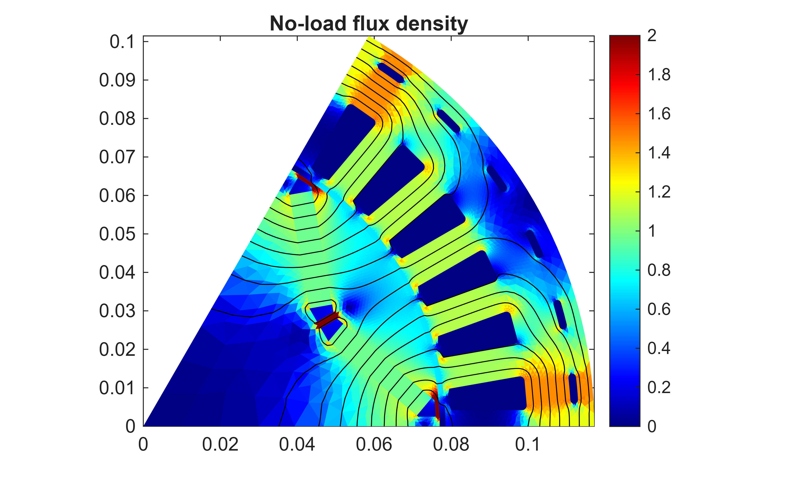
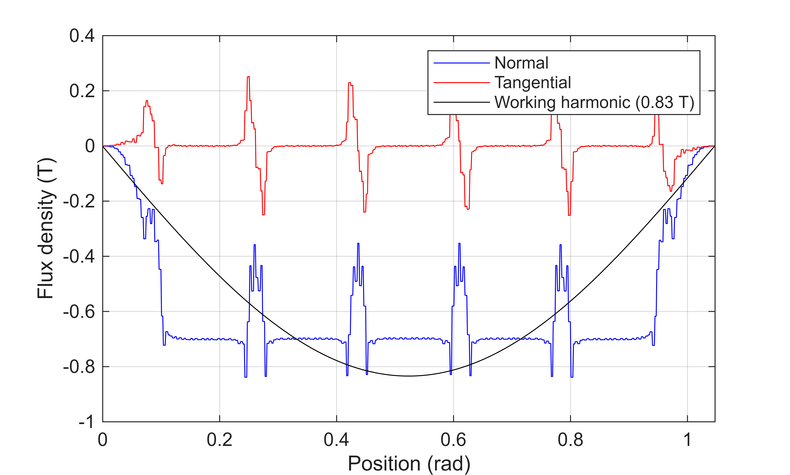

# Example 2 \- No\-load flux density
# Prequisites

Making sure that a model has already been initialized.

```matlab
if ~exist('motor', 'var')
    Example_01_Setting_up_a_Model;
    close all;
end
```

```matlabTextOutput
gmsh path E:\Software\Work\gmsh-4.11.1\ loaded from preference group 'emdtool' 
  Name       Size            Bytes  Class      Attributes

  motor      1x1                 8  RFmodel              
```


# Setting up a problem

```matlab
problem = MagneticsProblem.new(motor);

```
# Setting inputs and parameters

```matlab
%setting zero current density as source
phase_circuit = stator.winding;
phase_circuit.set_source('uniform coil current', zeros(stator.winding_spec.phases, 1)); %EXPLAIN

%rotor angle to analyse
pars = SimulationParameters('rotorAngle', 0);
%pars = SimulationParameters('rotorAngle', pi/8);
```
# Solving

```matlab
%solving
static_solution = problem.solve_static(pars);
```

```matlabTextOutput
Computing step/case 1 out of 1...
    Newton step 1, relative residual 1.
    Newton step 2, relative residual 17.7655.
     Relaxation automatically set to 0.9
    Newton step 3, relative residual 2.0989.
    Newton step 4, relative residual 1.8621.
    Newton step 5, relative residual 0.17625.
    Newton step 6, relative residual 0.042694.
    Newton step 7, relative residual 0.012857.
    Newton step 8, relative residual 0.0047723.
    Newton step 9, relative residual 0.0015798.
    Newton step 10, relative residual 0.00061399.
    Newton step 11, relative residual 0.00028158.
    Newton step 12, relative residual 0.00012791.
    Newton step 13, relative residual 3.8382e-05.
    Newton step 14, relative residual 2.5454e-06.
    Newton step 15, relative residual 4.039e-08.
```
# Post\-processing and visualizing

```matlab
%plotting flux density distribution
figure(5); clf; hold on; box on;
motor.plot_flux(static_solution);
title('No-load flux density');
```



```matlab

%plot airgap flux density waveform
figure(6); clf; hold on; box on; grid on;
motor.plot_airgap_flux_density(static_solution);
```



```matlab

%plot airgap flux density spectrum
figure(7); clf; hold on; box on; grid on;
motor.plot_airgap_flux_density(static_solution, 1, 'plot_spectrum', true);
```


[**NEXT UP**: Example 03 Torque Curve of Synchronous Machine](Example_03_Torque_Curve_of_Synchronous_Machine.html)