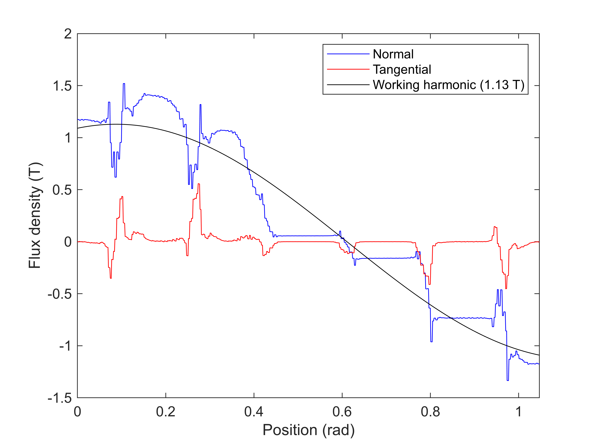
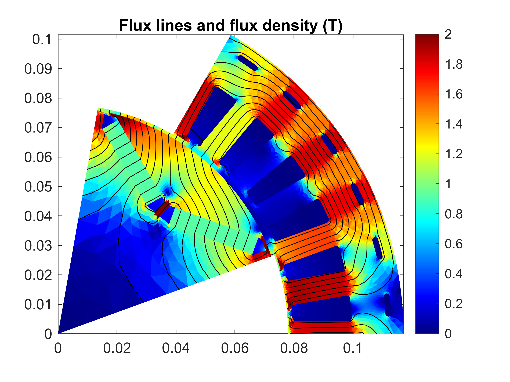
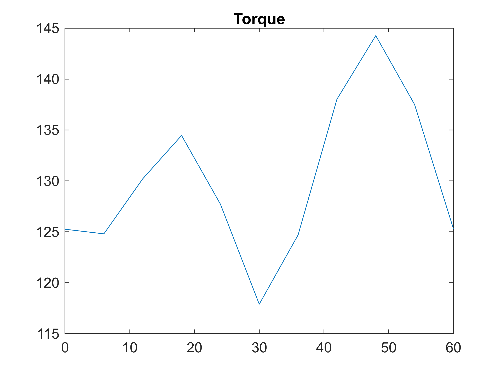
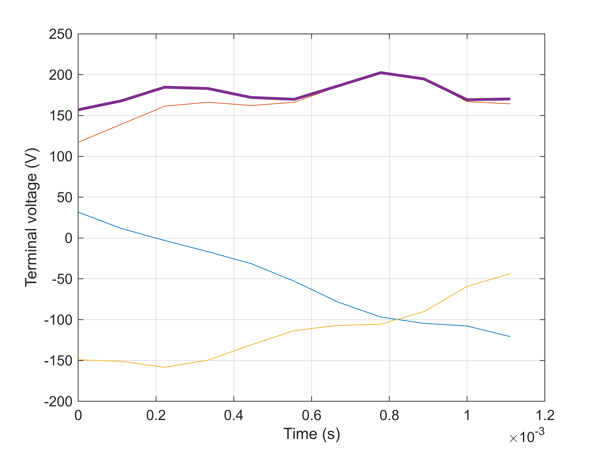

# Example 4 \- Stepping Analysis of a Synchronous Machine

**`Goal:`** `Perform magnetostatic stepping over different rotor angles, for a synchronous machine.` 


**`Result:`** `Different waveform plots, flux density plots, and a structure of important performance indicators.` 

# Prequisites

Making sure that a model has already been initialized.

```matlab
if ~exist('motor', 'var')
    Example_01_Setting_up_a_Model;
    close all;
end
```

```matlabTextOutput
gmsh path E:\Software\Work\gmsh-4.11.1\ loaded from preference group 'emdtool' 
  Name       Size            Bytes  Class      Attributes

  motor      1x1                 8  RFmodel              
```
# `Background`

This example analyses a synchronous (PM) machine at a single operating point (constant rpm, sinusoidal phase currents), using what is called 'static analysis' in `EMDtool`. Here, 'static' refers to the fact that that eddy currents and similar damping effects are ignored, otherwise it works very much like what one would expect from a constant\-rpm transient simulation with imposed current waveforms.

# Initializations

We again begin by instantiating a MagneticsProblem object

```matlab
problem = MagneticsProblem.new(motor);
```

and then specify the operating point to analyse

```matlab
rpm = 3000; %rpm
Jrms = 10e6; %rms current density
pole_angle = pi/180 * 90; %Note: 90 degrees corresponds to id = 0
```

Finally, to keep things fast, we only analyse one sixth of the electrical period (enough for typical distributed\-wound machines in ideal steady\-state) using a moderate 11 steps

```matlab
angles = linspace(0, 2*pi/6, 11); %electrical angles to step through
```
# Running the analysis
## Setting the excitation

First, we compute the current waveforms corresponding to our desired rms current, pole angle, and number of steps:

```matlab
phase_circuit = stator.winding;
spec = stator.winding_spec;
Ipeak = sqrt(2)*Jrms * phase_circuit.conductor_area_per_turn_and_coil();
Is = spec.xy(Ipeak*[cos(pole_angle); sin(pole_angle)], angles);
```

Next, we set the just\-computed waveforms as the excitation for the stator winding, exactly in the same fashion as we did in the torque curve example:

```matlab
phase_circuit.set_source('uniform coil current', Is);
```
## Simulation parameters

Next, we define the simulation parameters. For static stepping, the only crucial parameters are typically the frequency and the (mechanical) rotor angles to step through:

```matlab
%parameters
pars = SimulationParameters('f', rpm/60*dim.p, 'rotorAngle', angles/dim.p, ...
    'silent', ~true);
```
## Solution

Next, the problem is solved.

```matlab
stepping_solution = problem.solve_static(pars);
```

```matlabTextOutput
Computing step/case 1 out of 11...
    Newton step 1, relative residual 1.
    Newton step 2, relative residual 18.043.
     Relaxation automatically set to 0.9
    Newton step 3, relative residual 3.3023.
    Newton step 4, relative residual 1.2495.
    Newton step 5, relative residual 0.19708.
    Newton step 6, relative residual 0.059244.
    Newton step 7, relative residual 0.021485.
    Newton step 8, relative residual 0.0069899.
    Newton step 9, relative residual 0.0021695.
    Newton step 10, relative residual 0.00094776.
    Newton step 11, relative residual 0.00049132.
    Newton step 12, relative residual 0.00020549.
    Newton step 13, relative residual 7.0589e-05.
    Newton step 14, relative residual 2.1045e-05.
    Newton step 15, relative residual 7.1874e-06.
    Newton step 16, relative residual 1.6706e-07.
Computing step/case 2 out of 11...
    Newton step 1, relative residual 9.1616.
    Newton step 2, relative residual 0.029239.
    Newton step 3, relative residual 0.0017543.
    Newton step 4, relative residual 7.7909e-05.
    Newton step 5, relative residual 3.532e-06.
    Newton step 6, relative residual 2.6741e-08.
Computing step/case 3 out of 11...
    Newton step 1, relative residual 9.0937.
    Newton step 2, relative residual 0.014582.
    Newton step 3, relative residual 0.00062131.
    Newton step 4, relative residual 5.0827e-05.
    Newton step 5, relative residual 3.7208e-06.
    Newton step 6, relative residual 8.4766e-08.
Computing step/case 4 out of 11...
    Newton step 1, relative residual 9.0544.
    Newton step 2, relative residual 0.012704.
    Newton step 3, relative residual 0.0014285.
    Newton step 4, relative residual 7.5252e-05.
    Newton step 5, relative residual 1.4031e-06.
    Newton step 6, relative residual 3.8154e-08.
Computing step/case 5 out of 11...
    Newton step 1, relative residual 9.0768.
    Newton step 2, relative residual 0.0071109.
    Newton step 3, relative residual 0.00034649.
    Newton step 4, relative residual 1.8286e-05.
    Newton step 5, relative residual 4.0907e-07.
Computing step/case 6 out of 11...
    Newton step 1, relative residual 9.1055.
    Newton step 2, relative residual 0.01162.
    Newton step 3, relative residual 0.0018736.
    Newton step 4, relative residual 0.00023072.
    Newton step 5, relative residual 7.4157e-06.
    Newton step 6, relative residual 1.962e-07.
Computing step/case 7 out of 11...
    Newton step 1, relative residual 9.0779.
    Newton step 2, relative residual 0.053552.
    Newton step 3, relative residual 0.0052944.
    Newton step 4, relative residual 0.00033058.
    Newton step 5, relative residual 1.2514e-05.
    Newton step 6, relative residual 2.355e-07.
Computing step/case 8 out of 11...
    Newton step 1, relative residual 9.0271.
    Newton step 2, relative residual 0.020056.
    Newton step 3, relative residual 0.00066775.
    Newton step 4, relative residual 8.8412e-05.
    Newton step 5, relative residual 1.2657e-05.
    Newton step 6, relative residual 8.6345e-07.
Computing step/case 9 out of 11...
    Newton step 1, relative residual 9.0173.
    Newton step 2, relative residual 0.08393.
    Newton step 3, relative residual 0.012441.
    Newton step 4, relative residual 0.0039697.
    Newton step 5, relative residual 0.0010366.
    Newton step 6, relative residual 6.9793e-05.
    Newton step 7, relative residual 1.2795e-06.
    Newton step 8, relative residual 1.4703e-08.
Computing step/case 10 out of 11...
    Newton step 1, relative residual 9.0903.
    Newton step 2, relative residual 0.010136.
    Newton step 3, relative residual 0.0011861.
    Newton step 4, relative residual 0.00011047.
    Newton step 5, relative residual 1.5789e-05.
    Newton step 6, relative residual 8.9525e-07.
Computing step/case 11 out of 11...
    Newton step 1, relative residual 9.1738.
    Newton step 2, relative residual 0.010179.
    Newton step 3, relative residual 0.0014181.
    Newton step 4, relative residual 0.00020407.
    Newton step 5, relative residual 2.412e-05.
    Newton step 6, relative residual 9.4879e-07.
```
# Post\-processing
## Plotting

We proceed to plot the airgap flux density waveform,

```matlab
figure(4); clf; hold on; box on;
motor.plot_airgap_flux_density(stepping_solution, 11)
```



the flux density distribution at step 11,

```matlab
%plotting example of flux
figure(5); clf; hold on; box on;
motor.plot_flux(stepping_solution, 11);
```



the torque waveform

```matlab
%plotting torque
T = motor.compute_torque( stepping_solution );
figure(6); clf; hold on; box on; title('Torque');
plot(angles/pi*180, T);
```



and some voltage waveforms (note that the 'back\-emf' method returns the simply the time\-derivative of the flux linkage, without differentiating whether it's inductive or PM/field\-winding related)

```matlab
%voltages
voltage = phase_circuit.terminal_voltage(stepping_solution);
voltage_dq = phase_circuit.terminal_voltage( stepping_solution, 'output', 'space vector');
phase_voltage = phase_circuit.phase_bemf(stepping_solution);
phase_voltage_dq = phase_circuit.phase_voltage(stepping_solution, 'output', 'space vector');

%plotting
figure(7); clf; hold on; box on; grid on;
plot(stepping_solution.ts, voltage);
plot(stepping_solution.ts, colnorm(voltage_dq), 'linewidth', 2);
xlabel('Time (s)');
ylabel('Terminal voltage (V)');
```


## Results summary

Finally and importantly, we compute the results summary with the [`MotorModelBase.results_summary`](https://www.emdtool.com/api/MotorModelBase.html#results_summary-summary-of-analysis-results) method. The method returns a Matlab structure; in addition we are giving the `'verbose'` argument to also display the results in the Matlab command window.

```matlab
summary = motor.results_summary(stepping_solution, 'verbose', true);
```

```matlabTextOutput
Warning: The extruded block height 150 mm is less than the skin depth (17.608 mm) at 10x fundamental frequency.  The results may be inaccurate. Consider running a transient simulation /  setting the circuit as active.
 
Summary of results: 
 git_commit_ID : 74a40da651141fec568138a48fad9bc51d027962
 rpm : 3000
 f : 150
 torque_waveform : (array)
 torque_mean : 130.0088
 shaft_power : 40843.4653
 torque_ripple_min_to_max : 26.3679
 torque_ripple_rms : 7.5695
 timestamps : (array)
 efficiency : 0.95693
 total_losses : 1838.3056
 input_power_from_power_balance : 42681.7709
 input_power_from_terminal_waveforms : 42348.0453
**********************************************************
phase_circuit_data:
 input_power : 42348.0453
 input_power_waveform : (array)
 apparent_input_power : 52594.4956
 displacement_power_factor : 0.6792
 I_phase_waveform : (array)
 I_phase_dq : 8.141787e-14      404.7173
 I_phase_rms : 286.1783
 phase_advance_angle_deg : -1.4211e-14
 I_terminal_waveform : (array)
 I_terminal_rms : 286.1783
 I_terminal_THD : 2.0206e-31  2.8878e-32  3.4654e-32
 U_phase_waveform : (array)
 U_phase_induced : (array)
 U_phase_dq : -75.3802      69.7574
 U_phase_rms : 73.4122
 U1_phase_rms : 72.6233
 phase_flux_linkage : (array)
 U_terminal_waveform : (array)
 U_terminal_rms : 127.1536
 U1_terminal_rms : 125.7872
 coil_current_density_rms : 10000000
 supply_mode : uniform coil current
**********************************************************
 total_iron_losses : 437.8727
**********************************************************
iron_loss_data:
 P_total : 437.8727
 P_total_time : (array)
 P_hysteresis : 337.8309
 P_rotor : 35.7423
 P_hysteresis_rotor : 30.859
 P_eddy_rotor : 4.8834
 P_eddy : 100.0418
 P_excess : 0
 P_excess_rotor : 0
 p_hysteresis_elementwise : (array)
 p_eddy_elementwise : (array)
 p_excess_elementwise : (array)
**********************************************************
iron_losses_per_domain:
 stator_Stator_core : 402.1304
 stator_Stator_slot_opening : 0
 stator_Stator_winding_segment : 0
 stator_Cooling_channel : 0
 rotor_Core : 35.6747
 rotor_Shaft : 0.067674
 rotor_Air : 0
 rotor_Magnet_1 : 0
 rotor_Magnet_2 : 0
**********************************************************
**********************************************************
 total_circuit_losses : 1400.4329
 total_Phasewinding_losses : 1395.3803
**********************************************************
Phasewinding_loss_data:
 conductor_loss_waveform : (array)
 mean_total_losses : 1395.3803
 mean_AC_losses : 0
 mean_DC_losses : 1395.3803
 mean_EW_losses : 653.0731
 mean_conductor_losses : 40.93833      40.93833      310.9356      310.9356      345.8162      345.8162
 mean_circulating_current_losses : 2.2737e-13
 mean_circulating_current_losses_on_phase_level : 0
 total_DC_losses : (array)
**********************************************************
 total_Magnets_losses : 3.5317
**********************************************************
Magnets_loss_data:
 mean_losses_per_conductor : 1.6725      1.8592
 conductor_loss_waveform : (array)
**********************************************************
 total_Shaft_losses : 1.5208
**********************************************************
Shaft_loss_data:
 mean_losses_per_conductor : 1.5208
 conductor_loss_waveform : (array)
 elementwise_current_density_array : (array)
**********************************************************
```


[**NEXT UP**: Example 05 Transient Analysis of Synchronous Machine](Example_05_Transient_Analysis_of_Synchronous_Machine.html)