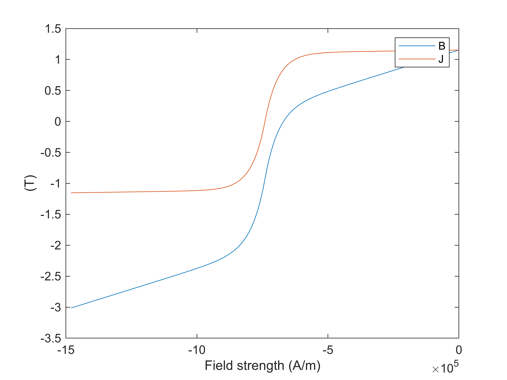
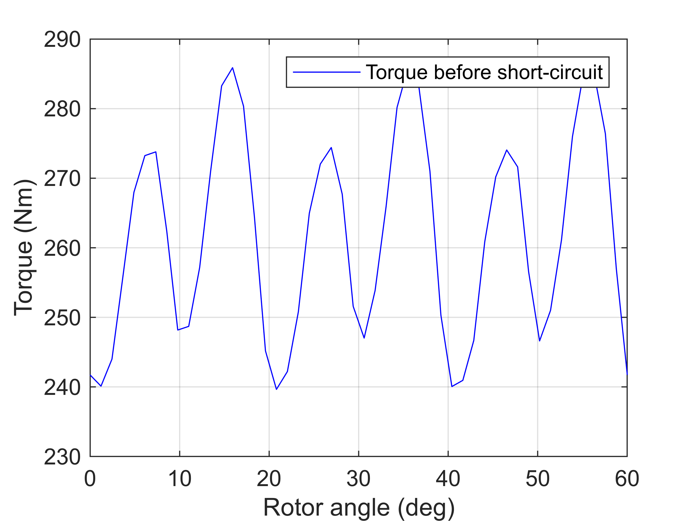
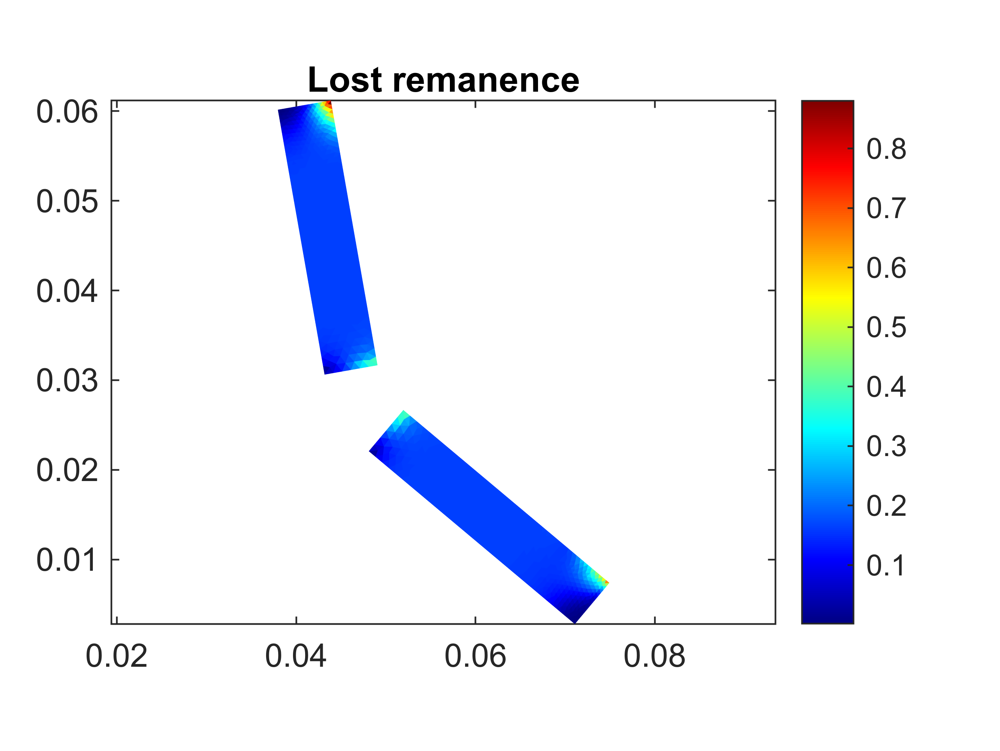
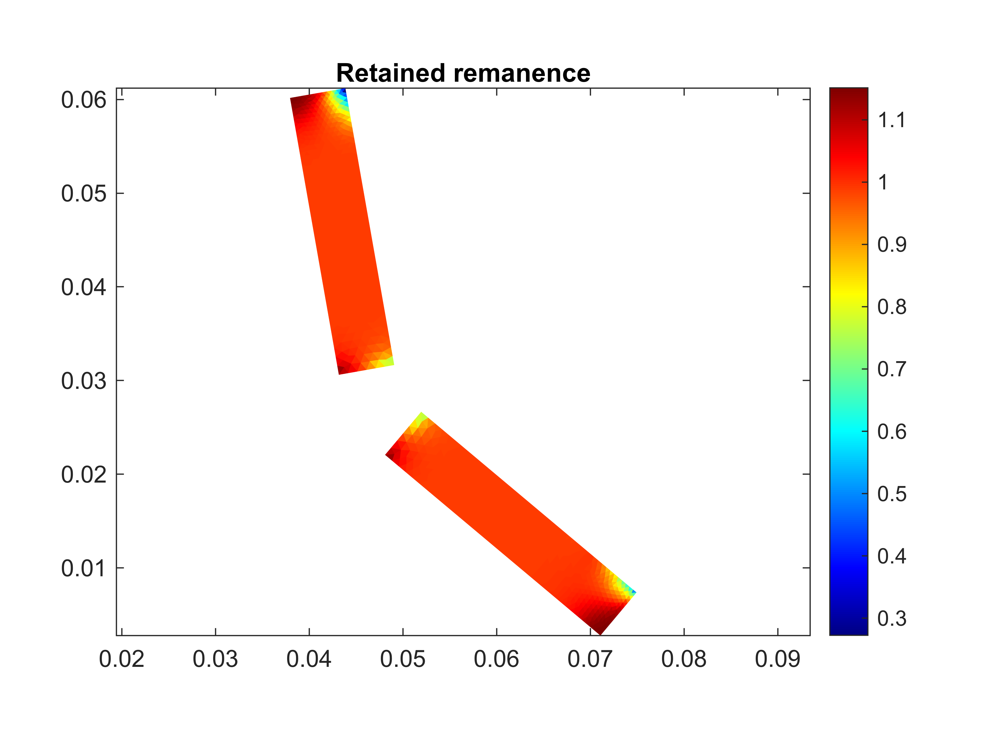
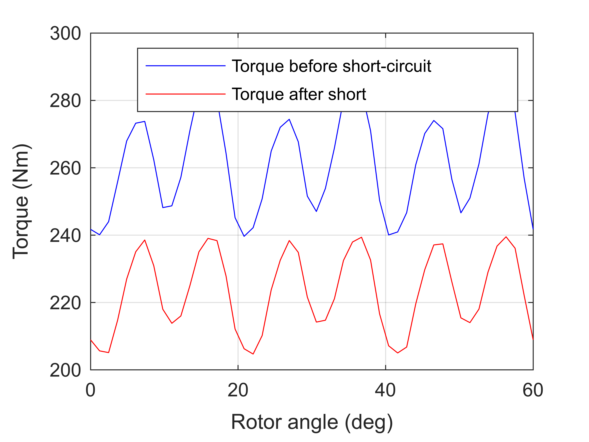

# Example 7 \- Demagnetization Analysis of a Synchronous Machine

**`Goal:`** `Evaluate demagnetization behaviour using an advanced nonlinear demagnetization model.` 


**`Result:`** `Amount of torque lost with the same current supply, plus visualizations of the magnet damage.` 

# Prequisites

Making sure that a model has already been initialized.

```matlab
if ~exist('motor', 'var')
    Example_01_Setting_up_a_Model;
    close all;
end
```

```matlabTextOutput
gmsh path E:\Software\Work\gmsh-4.11.1\ loaded from preference group 'emdtool' 
  Name       Size            Bytes  Class      Attributes

  motor      1x1                 8  RFmodel              
```
# Using an Advanced Material Model

Next, we change the permanent magnet material from the default [`Material`](https://www.emdtool.com/api/Material.html) class with its linear magnetization behaviour, to a step more advanced model called the [`DemagMaterial1`](https://www.emdtool.com/api/Material.html).


First, we initialize the material from the already\-set linear material, copying all the basic properties.

```matlab
demag_material = DemagMaterial1().from_material(dim.magnet_material);
```

Next, we specify the behaviour we want. First, we set the material to use a single analytical exponential\-style demagnetization model. While we could explicitly specify a demagnetization curve to use, this is way faster.

```matlab
demag_material.use_simple_model = true;
```

Next, in order to model the effect of a short\-circuit scenario on the motors subsequent behaviour, we instruct the material to remember any permanent demagnetization it has encountered.

```matlab
demag_material.retain_state = true;
```

Finally, we visualize the modelled BH and BJ curves. For this, we need to first initialize the simple model for the given rotor remperature. Please note that when initializing a `MagneticsProblem` object, the model is re\-initialized for the rotor temperature seen by the problem at that time.

```matlab
demag_material.initialize_simple_model(dim.temperature_rotor);
figure(3); clf; hold on; box on;
demag_material.visualize_demag_curve();
```



Finally, we re\-initialize our motor model to use the new material model.

```matlab
dim.magnet_material = demag_material;
stator = Stator(dim);
rotor = VIPM1(dim);
motor = RFmodel(dim, stator, rotor);
```

Finally, since the geometry templates normally create their own copies of the materials given, we fetch and re\-assign our `demag_material` variable to point to the object actually used by the model

```matlab
demag_material = rotor.materials.get(demag_material.name);
```
# Healthy behaviour

Next, we simulate the behaviour before the short\-circuit, computing the torque waveform at a rather large current density, using magnetostatic analysis.

```matlab
rpm = 5000;
Jrms = 25e6;

%interesting circuits
phase_circuit = stator.winding;
spec = stator.winding_spec;

%initializing problem
problem = MagneticsProblem(motor);

%setting supply
Ipeak = sqrt(2)*Jrms * phase_circuit.conductor_area_per_turn_and_coil();
idq = [0; Ipeak];
angles = linspace(0, 2*pi/2, 50);
Ipeak = sqrt(2)*Jrms * phase_circuit.conductor_area_per_turn_and_coil();
Is_static = spec.xy(idq, angles);
phase_circuit.set_source('uniform coil current', Is_static);

%setting parameters and simulating
pars_static = SimulationParameters('f', rpm/60*dim.p, 'rotorAngle', angles/dim.p, ...
    'silent', true);
stepping_solution = problem.solve_static(pars_static);

%computing and plotting the torque
T_before_short = motor.compute_torque(stepping_solution);
figure(6); clf; hold on; box on; grid on;
plot(angles/pi*180/dim.p, T_before_short, 'b');
ylabel('Torque (Nm)')
xlabel('Rotor angle (deg)')
legend('Torque before short-circuit')
```


# Short\-Circuit Simulation

Next, we run the short\-circuit simulation in the same way as before.

```matlab
%for improved simulation speed
for c = rotor.circuits
    c.enabled = false;
end

%setting parameters
pars = SimulationParameters('f', rpm/60*dim.p, 'N_periods', 1, ...
    'N_stepsPerPeriod', 50, 'silent', true);

%current supply, before short
Is = spec.xy(idq, 2*pi*pars.f*pars.ts);

%setting a ShortCircuit source
T_period = 1/pars.f;
source = ShortCircuit;
source.short_at = T_period * 0.2; %instant of the short

%supply-type before the short
source.supply_before_short = "terminal current";
source.supply = Is;
phase_circuit.set_source('circuit', source);

%solution
harmonic_solution = problem.solve_quasistatic(pars);
stepping_solution = problem.solve_stepping(pars);
```
# Post\-processing

Next, we visualize the damage to the magnets. We plot both the actual remanence retained (i.e. the intersection of the B(H) curve with the H=0 axis), and the difference between the retained remanence and the remanence of a healthy magnet.

```matlab
figure(4); clf; hold on; box on; axis equal;
title('Lost remanence')
demag_material.visualize_lost_remanence();
colorbar;
```



```matlab

figure(5); clf; hold on; box on; axis equal;
title('Retained remanence')
demag_material.visualize_retained_remanence();      
colorbar;
```


# Performance after short\-circuit

Finally, we recompute the torque waveform. Since we set the `.retain_remanence` property to `true`, the magnet material is now aware of its damaged state, and we see a rather significant loss in torque.

```matlab
phase_circuit.set_source('uniform coil current', Is_static);
stepping_solution = problem.solve_static(pars_static);
T_after_short = motor.compute_torque(stepping_solution);

figure(6); clf; hold on; box on; grid on;
plot(angles/pi*180/dim.p, T_before_short, 'b');
plot(angles/pi*180/dim.p, T_after_short, 'r');
ylabel('Torque (Nm)')
xlabel('Rotor angle (deg)')
legend('Torque before short-circuit', 'Torque after short')
```




[**NEXT UP**: Example 08 Setting up an Induction Machine Model](Example_08_Setting_up_an_Induction_Machine_Model.html)