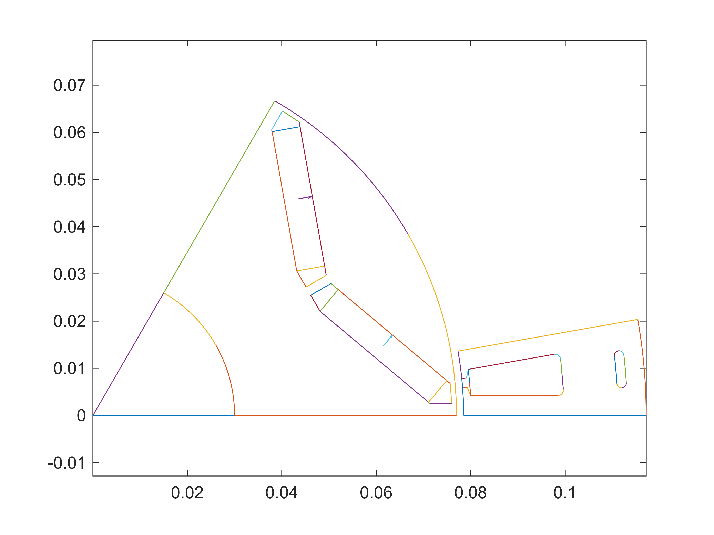
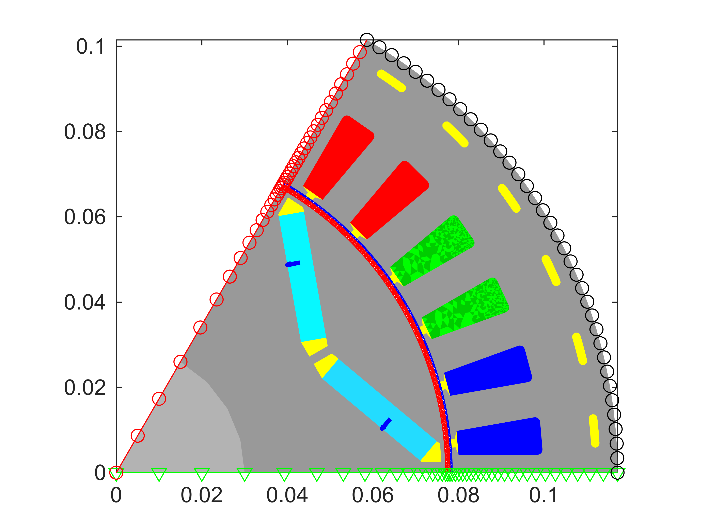

# Example 1

This script demonstrates setting up a basic EMDtool motor model using geometry templates.

# Setting some dimensions
## General dimensions
```matlab
dim = struct();

dim.p = 3;
dim.symmetry_sectors = dim.p*2;
dim.delta = 1.5e-3;
dim.leff = 150e-3;

dim.temperature_stator = 120;
dim.temperature_rotor = 120;
```
## Stator dimensions
```matlab
PHASES = 3;
SLOTS_PER_POLE_AND_PHASE = 2;
AIRGAP_FLUX_DENSITY_FOR_SIZING = 1;

%slots
dim.Qs = PHASES * 2*dim.p * SLOTS_PER_POLE_AND_PHASE;

%winding
winding = DistributedWindingSpec(dim);
winding.N_layers = 1;
winding.N_series = 12;
winding.phases = PHASES;
winding.a = dim.p*2;
dim.stator_winding = winding;

%inner and outer diameter
dim.Sin = 157e-3/2; %inner radius of stator
if dim.p == 1
    dim.Sout = dim.Sin / 0.5;
elseif dim.p == 2
    dim.Sout = dim.Sin / 0.6;
else
    %very rough
    dim.Sout = dim.Sin / 0.67;
end

%slot opening and bottom specs
dim.htt_taper_s = 1e-3; %slot opening, straight part before taper
dim.htt_s = 1.5e-3;
dim.wso_s = 2e-3;
dim.r_slotbottom_s = 1.2e-3;

%yoke height
hys = 2*pi*dim.Sin / (2*dim.p) * AIRGAP_FLUX_DENSITY_FOR_SIZING * 2/pi / 2 / 1.5;
dim.hslot_s = abs(dim.Sout - dim.Sin) - hys;
dim.wtooth_s = 2*pi*(dim.Sin + dim.htt_s)/dim.Qs * 0.6;

%adding cooling holes to the yoke just because
dim.alpha_cooling_hole = 0.3;
dim.h_cooling_hole = 2e-3;
dim.h_cooling_rib = 4e-3;

%materials
dim.stator_core_material = SteelLibrary.create('M270-35A');
dim.stator_stacking_factor = 1;
dim.stator_wedge_material = 0;

```
## Rotor dimensions
```matlab
dim.Rout = dim.Sin - dim.delta;
dim.Rin = 30e-3;

dim.w_mag = 30e-3;
dim.h_mag = 6e-3;
dim.angle_mag = pi/180 * 20;

dim.w_bridge_interpole = 5e-3;
dim.w_bridge_center = 2e-3;
dim.w_bridge_out = 1e-3;

dim.w_pocket_in = 2e-3;
dim.w_pocket_out = 1e-3;

dim.magnet_material = PMlibrary.create('N42SH');
dim.rotor_core_material = dim.stator_core_material;
dim.shaft_material = 1;
```
# Creating geometries and a model
## Geometries and visualization
```matlab
stator = Stator(dim);
rotor = VIPM1(dim);

%plotting geometries
figure(1); clf; hold on; box on; axis equal;
stator.plot_geometry();
rotor.plot_geometry();
```


## Model and visualization
```matlab
motor = RFmodel(dim, stator, rotor);
```

```matlabTextOutput
gmsh path E:\Software\Work\gmsh-4.11.1\ loaded from preference group 'emdtool' 
```

```matlab

figure(2); clf; hold on; box on; axis equal;
motor.visualize('plot_axial', false, 'plot_ag', true, 'plot_nodes', true);
```


