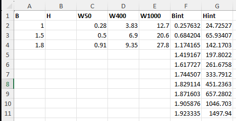

# Defining (new) materials in EMDtool

`EMDtool` features quite a few built-in materials. In particular, please see the

* [Old number-coded default materials](../../api/api/get_defaultMaterials.html)

* [The SteelLibrary](../../api/api/SteelLibrary.html) factory class for a set of electrical steels

* [The SteelLibrary](../../api/api/SteelLibrary.html) factory class for a set of permanent magnet materials

But, what if you want to define a material with some different properties? There are multiple options for that - please read on!

## I only need to change some scalar properties

If you only need to change some scalar properties - such as the density or the remanence flux density - the simplest way to do it is by starting from an existing material,
and then changing the corresponding properties in the `material_object.material_properties` struct:

```matlab
magnet_material = PMlibrary.create('N42SH');
%increasing the temperature dependency coeff of Br
magnet_material.material_properties.alpha_Br = -0.16e-2;
dim.magnet_material = magnet_material;
```

See the [documentation of the MaterialBase class for default naming of the material properties](../../api//MaterialBase#material_properties-struct-of-material-properties.html).

## How do I change the BH curve

Changing the BH curve does not exactly follow the process above, due to legacy reasons, and due to the the fact that `EMDtool` generates interpolation and extrapolation
data based on the given BH data.

The solution is the modify the `.B` and `.H` properties of the material object (both must be column vectors of the same size, and then re-initialization the inter-extrapolation data:

```matlab
core_material = SteelLibrary.create('NO20'); %beginning with an existing material

%setting analytical BH data with low saturation (1.5 T):
core_material.B = linspace(0, 2.5, 18)';
core_material.H = H_langevin_single(core_material.B, 1.5, 50);

%generating interpolation and extrapolation data
core_material.initialize_material_data();

figure(10); clf; hold on;
core_material.plot_BH(); %plotting BH data
```

## I want to define a library of steels of my own

Having your own preferred steel grades collected in a single place is indeed handy. The simplest way to do this is by using the `SteelLibrary` class with a custom datasheet file as an argument:

```matlab
core_material = SteelLibrary.create('own_grade_name', ...
    'file_to_use', '<path_to_file>.xlsx');
```

Here, the grade name `own_grade_name` must correspond the name of the Sheet in the given Excel file. The data format is visualized below:



Here:
* B : Flux density corresponding to the loss table (T)
* H : Field strength (A/m) corresponding to the flux density above. Can be left empty is separate BH curve data is used.
* WXXX : Loss density (W/kg) at XXX Hz
* Bint, Hint : separate BH data to be used for the BH curve. Optional; if not given then the B and H columns will be used.
