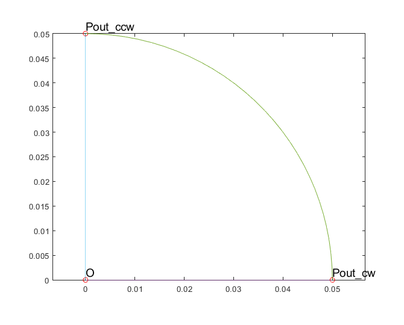
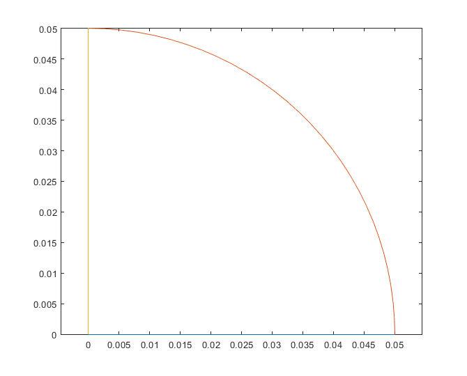
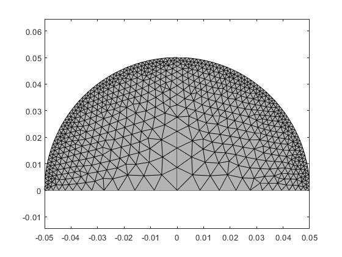

# Creating your own geometries

So, how to create your own geometries? Read here to learn, or at least get started.

# Model hierarchy

Before anything else, let's rehash how analysis with `EMDtool` works. Like we saw in the [EMDtool briefly](../emdtool_briefly) page, we obtain results by first solving a [`problem`](../../api/MagneticsProblem.html)
object.

The `problem`, just before ~~has eaten~~ is associated with a `Model`. 95 % of the time, it is an [RFmodel](../../api/RFmodel.html), containing as `components` a _stator_ and a _rotor_. The model has
a few additional responsibilities, like

* Returning an airgap matrix for modelling rotation. You may have to overwrite this method to study e.g. magnetic gears or other systems where you have two or more components rotating at different speeds.

* Returning some properties for the components. For example, the stator and rotor typically are at different temperatures, and see a different frequency in harmonic analysis.

Anyways, this now brings us to the components, for example the `stator`. Each component is a subclass of the [`GeoBase`](../../api/GeoBase.html) class, typically called a **template**. 
To create your own custom geometries, templates are what you have to work with.

# Geometry components

Geometry components - subclasses of the [`GeoBase`](../../api/GeoBase.html) class - each describe one "independent" component of the problem geometry - think a stator and a rotor.

Each component contains all the information required to describe it (in analysis-terms at least), in the corresponding `properties`:

* `.mesh` : a mesh object, containing the finite element mesh elements and nodes

* `.domains` : [Domains](../../api/Domain.html) of the component, each corresponding to an interesting part of the component, like for example the stator core. Each Domain then contains at least:

	* The [Material](../../api/MaterialBase.html) it is made of.
	
	* The elements that belong to it.
	
* `.materials` : all [Materials](../../api/MaterialBase.html) that are present in the component.

* `.circuits` : all [Circuits](../../api/CircuitBase.html) in the component, if any.

Finally, what turns a mere component into a template is the fact that it is **parametric**. This means that each template class implements the `.create_geometry` method. This method takes as an input a
`structure` of dimensions, and uses the information to create the Domains, Materials, Circuits, and enough information to allow automatic mesh generation with the `.mesh_geometry` method. More of this shortly.

# Minimal symmetry regions

Before diving deeper into geometry templates, let's repeat one important detail: `EMDtool` is very much tailored towards modelling **repetitive** geometries. 

After all, most electrical machines are like that. Each rotor pole is often identical to the others, as is each stator slot. Please note that we are only speaking about the _geometry_ here - of course each
slot will typically host different coil sides, and each pole will be magnetized in a different direction. Yet, the geometry - the shapes of everything - will be just repeated.

The great-parent component classes - often a [`RadialGeometry`](../../api/RadialGeometry.html) (in turn a subclass of [`GeoBase`](../../api/GeoBase.html)) are 
built with precisely this in mind. Indeed, it
is assumed that the `.create_geometry` method of any subclass only creates the geometry for one slot or pole pitch. The boring parts, such as

* meshing the slot or pole pitch

* replicating and rotating the mesh enough times to cover the required model sector

* gluing the repeated mesh components to each other

* assigning the correct materials and boundary conditions to the replicated parts

* assigning the replicated parts to the correct circuits

* updating permanent magnet or material orientation

are then taken care by the parent classes.

# Creating a geometry template

Like implied above, you can create geometry template class by subclassing the [GeoBase](../../api/GeoBase.html) class, and then implementing the `.create_geometry` method.

**Note:** in practice, you will in fact be subclassing another subclass such as [StatorBase](../../api/StatorBase.html), [SlottedRotorBase](../../api/SlottedRotorBase.html), or
[SynRotorBase](../../api/SynRotorBase.html). This is because many of the finer analysis features require some other methods from the templates. An example is the `.d_axis_angle` for rotor templates, to
allow automatic dq-transformations.

Most likely, you will implement the `.create_geometry` method in its own separate file. Inside the file, you will generally do the following 
steps:

1. Create the `Material`s used in the model, and add them to the component.

1. Create the `Domain`s used and add them to the component.

1. Create the `Circuit`s used, and add them to the component.

Now, let's take a brief look at each of these steps.

## Creating Materials

Materials are objects, and subclasses of the `MaterialBase` class. Most importantly, they contain the functionality required for modelling
the (generally non-linear) B-H relationship of the material in question.

The majority of the time, your materials will be of the simple anisotropic, non-hysteretic `Material` class, and created using one of the 
following methods:

* Using the `Material.create(0)` method to use one of the early `EMDtool` built-in materials. In the example before, the index 0 would
be for air, folks

* Using the `PMlibrary.create` or `SteelLibrary.create` methods, to gain access to more, newer, and more regularly-updated materials.

* Use your own materials, most often wrapped inside a function calling the `Material.from_specs` method.


After creation, the material objects are added to your component with `this.add_material( material_object )`. Here `this` of
course refers to your template object, like `this` in Java or `self` in Python). For some reason, the Matlab documentation uses `obj` 
instead.

## Creating Domains

Domains are also objects, each consisting of a single material (at least for the foreseeable future), and representing one interesting part
of the geometry. For instance, one bar of an induction motor would normally by a `Domain`, as would the part of the stator core within one slot
pitch.

Domains themselves are very easy to define. However, for them to actually mean anything, you will have to add one or more `Surfaces` to each
of them, to tell `EMDtool` something about the actual geometry. We will take a closer look on this later.

For now, the code snippet below demonstrates the usage of `Domains` in a simple form.

```matlab
core_domain = Domain('Rotor_core', core_material);
core_domain.add_surface(core_surface);
this.add_domain(core_domain);
```

## Creating Circuits

Although optional, `Circuits` do feature as a part of most geometry templates. After all, motors typically have windings where currents
should flow, and other conductive bodies where they should not but still do (eddy currents).

An example tells more than a thousand words, so here is one:

````matlab
core_circuit = SheetCircuit('Rotor_core');
core_conductor = SolidConductor(core_domain);
core_circuit.add_conductor(core_conductor);
this.add_circuit(core_circuit);
```

In this example, we are presumably dealing with a high-speed induction motor with a solid core. To model the eddy-currents induced
into the core, we have to create a `CircuitBase` object for it.

Specifically, we will create a `SheetCircuit` object. A sheet circuit is a special kind of circuit, reserved for solid bodies that
span the entire circumference of a motor. Think a cylindrical copper shell (a sheet) used as an eddy current shield, a solid shaft, a
solid frame, or indeed a solid core.

**Note:** Were we modelling the entire cross section of the machine, there would be nothing special about a sheet circuit. However,
the assumption in `EMDtool` is that we are only modelling one symmetry sector. Say we have a conducting body in the symmetry sector, and
by extension a similar body in all the other (non-modelled) sectors. In reality, the sector-bodies may form a single continuous body
(like a shaft or our rotor core in the example), or they may be separate from each other (like a PM segment inside an IPM rotor). The
former case would call for a `SheetCircuit`, whereas for the latter a `BlockCircuit` or perhaps an `ExtrudedBlockCircuit` would be more
appropriate.

Back to the example: after creating the circuit, we create a `SolidConductor` object to wrap the `Core` `Domain` created earlier. Then,
this conductor is added to the circuit, and the circuit is added to the geometry template itself.


# Case Example: Solid Rotor for a High-Speed Induction Motor

Next, let's take a look at a very simple yet complete-ish template example. The template in question is for a very simple high-speed 
induction motor rotor: no slits, no coats, no shaft.

The template is located inside a folder called `@SimpleSolidRotor`, with the @-sign telling Matlab that a folder defines a class.

Inside the folder, the first file is the main class definition file `SimpleSolidRotor.m`. Its entire contents are listed below:

```matlab
classdef SimpleSolidRotor < SynRotorBase
    methods
        create_geometry(this)
    end
end
```

So, the class inherits the `SynRotorBase` class. Even though not _synchronous_, inheriting this class saves us some trouble of implementing
some other functionality needed (see the `RadialGeometry` class for a list).

Furthermore, the class file tells Matlab that the main geometry creation function `create_geometry` in inside a different file. Let's
take a look at it next.

## The `.create_geometry` method

The first few lines of the `create_geometry.m` file read

```matlab
function create_geometry(this)

dim = this.dimensions;
Rout = dim.Rout; %outer radius
angle_pole = pi / dim.p; %pole pitch
lcar_ag = Airgap.characteristic_length(this);
lcar_center = Rout/5;
```

What happens here is that we extract the dimensions `structure` given as input to the class constructor, and then save the radius of 
the rotor along with its pole pitch (in radians) to internal variables `Rout` and `angle_pole`. Finally, we compute some _characteristic lengths_ to 
control the mesh density on the airgap surface and the rotor center, respectively.

Next, we repeat the steps we already saw earlier, initializing the Materials, Domains, and Circuits needed for the model.

```matlab
core_material = Material.create( dim.rotor_core_material );
this.add_material(core_material);

core_domain = Domain('Rotor_core', core_material);
this.add_domain(core_domain);

core_circuit = SheetCircuit('Rotor_core');
core_conductor = SolidConductor(core_domain);
core_circuit.add_conductor(core_conductor);
this.add_circuit(core_circuit);
```

At this point, we have only one step remaining - creating the actual geometry. As this is usually the most complex task, let's take a closer look at it.

## Creating the actual geometry

Now, let's see how the geometry is actually created. Now, please remember two things:

1. The rotor is a simple solid cylinder.

1. We only need to create the geometry for one pole pitch - the parent classes then take care of replicating the geometry.

With this in mind, we create three [`Points`](../../api/Point.html):

```matlab
%creating Points
O = Origin(lcar_center);
Pout_cw = Point([dim.Rout;0], lcar_ag);
Pout_ccw = Pout_cw.mirror(angle_pole);
```

The first point `O` is, unsurprisingly, the origin located at (0, 0). The next point `Pout_cw` then represents the outermost corner point of the minimal symmetry sector, on the 
intersection of the x-axis and the rotor circumference. The subscript _cw_ refers to the fact that the Point lies on the _clockwise_ boundary. Finally, we get 
the corresponding _counter-clockwise_ boundary point `P_ccw` by mirroring `Pout_cw` across the pole pitch.

Next, we create the [`Surface`](../../api/Surface.html) for the rotor core. Next, we specify its outer boundary by adding to it (in the correct order) the

* [`Line`](../../api/Line.html) between `O` and `Pout_cw`

* [`Arc`](../../api/Arc.html) between `Pout_cw` and `Pout_ccw`, centered at `O`. This Arc is **named** _'n_ag'_, to tell `EMDtool` it lies on the airgap surface, to allow for automatic airgap 
mesh generation later on.

* Line between `Pout_ccw` and `O`

and then add the newly-created surface to the rotor core Domain.

```matlab
%creating surface
core_surface = Surface('');
core_surface.add_curve(geo.line, O, Pout_cw);
core_surface.add_curve(geo.arc, Pout_cw, O, Pout_ccw, 'n_ag');
core_surface.add_curve(geo.line, Pout_ccw, O);

%adding surface to domain
core_domain.add_surface(core_surface);
```

For clarity, the figure below shows the three points above, as well as the core surface.



**Note:_** As you can read in the documentation, [`Arcs`](../../api/Arc.html) have to be strictly less than 180 degrees in span. Thus, the above example will fail for two-pole machines. For robustness,
we should use an extra third point `Pmid_ccw = Pout_cw.rotate(angle_pole/2);` on the airgap surface, with corresponding two airgap Arcs.

Finally, we will have specify that the clockwise and counter-clockwise boundaries are _periodic_ - to allow for correct mesh replication and finally correct boundary conditions in the final model.

```matlab
%setting periodicity
geo.set_periodic(O, Pout_cw, O, Pout_ccw);
```

**_Hint:_** When making geometries, it often **extremely** useful to temporarily plot Points and Surfaces inside the `.create_geometry` method. Below is a snippet of how our example here could be debugged.

```matlab
O.plot('O', 'ro');
Pout_cw.plot('Pout\_cw', 'ro');
Pout_ccw.plot('Pout\_ccw', 'ro');
core_surface.plot();
```

## Using the example template

Finally, below is an example snippet of how the geometry template could be used, along with the resulting plots. As you can see, the elementary geometry only covers one pole pitch, while the 
final resulting mesh covers the symmetry sector of the final model-to-be (assumed 180 degrees here, to showcase the functionality).

```matlab
dim = struct();

dim.p = 2;
dim.symmetry_sectors = 2;

dim.delta = 3e-3;
dim.Rout = 5e-2;

dim.rotor_core_material = 1;


figure(1); clf; hold on; box on; axis equal;
rotor = SimpleSolidRotor(dim);
rotor.plot_geometry();

rotor.mesh_geometry();
figure(2); clf; hold on; box on; axis equal;
rotor.visualize('linestyle', '-');
```



