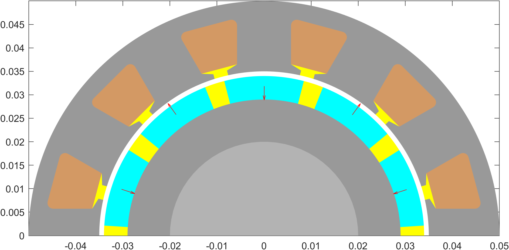

# Overview of popular `EMDtool` geometry templates

# Stators

## Stator

The one stator template to rule them all, the [`Stator`](../../api/Stator.html) is the main template for typical radial-flux machine stator geometries. It supports, among other things

* Inrunner and outrunner geometries

* Single and double-layer windings

* Radial and circumferential winding layer directions (i.e. concentrated and distributed-style winding layers)

## LinearStator

To do.

# Rotors

## SPM1

A surface-PM rotor template with arc magnets. Supports:
 * inrunner and outrunner geometries
 * retaining sleeves
 * axially and circumferentially segmented magnets
 * Halbach arrays
 * custom curvature for the airgap-facing magnet side
 * Cooling holes (experimental)

## BreadloafRotor

## VIPM1

## HSIPM1

## HSIPM2

