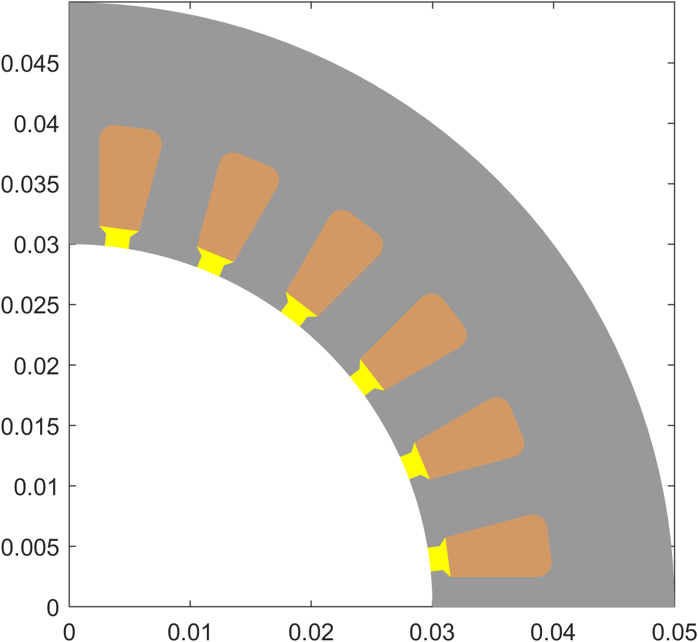
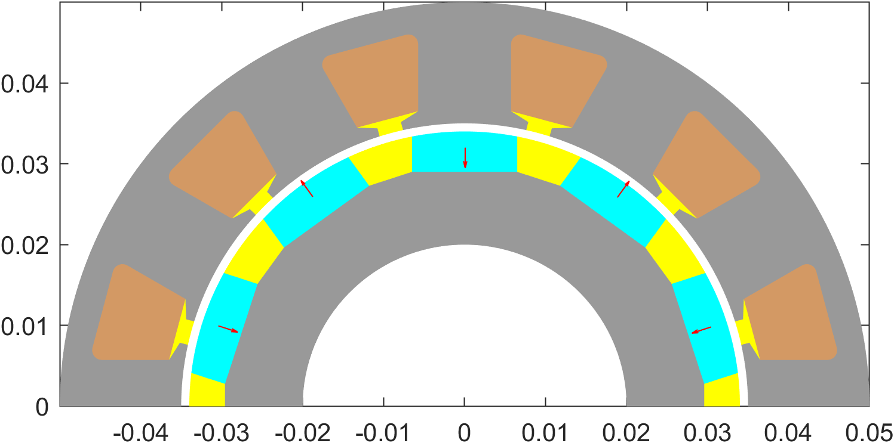
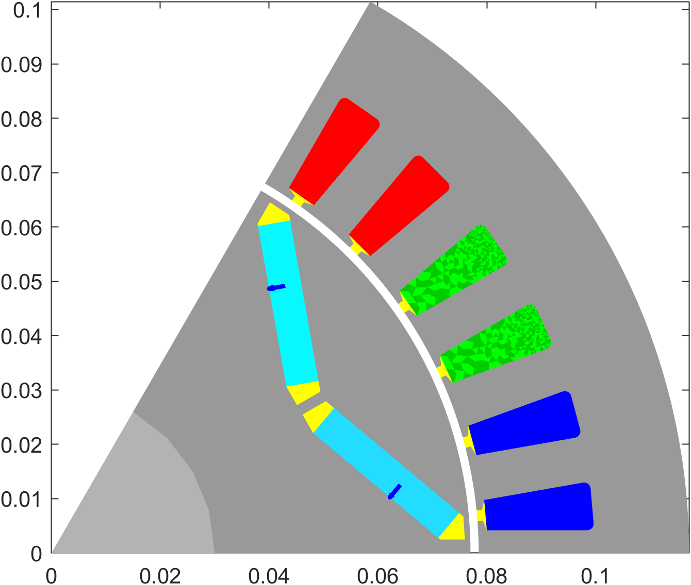
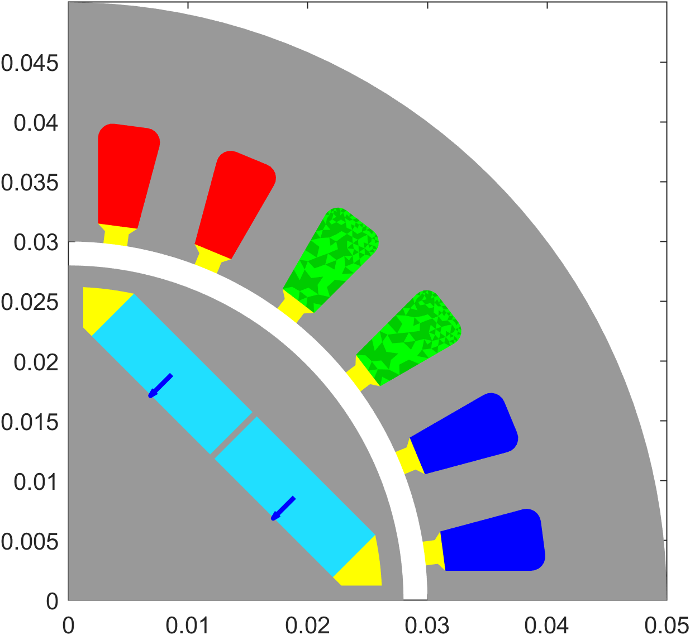
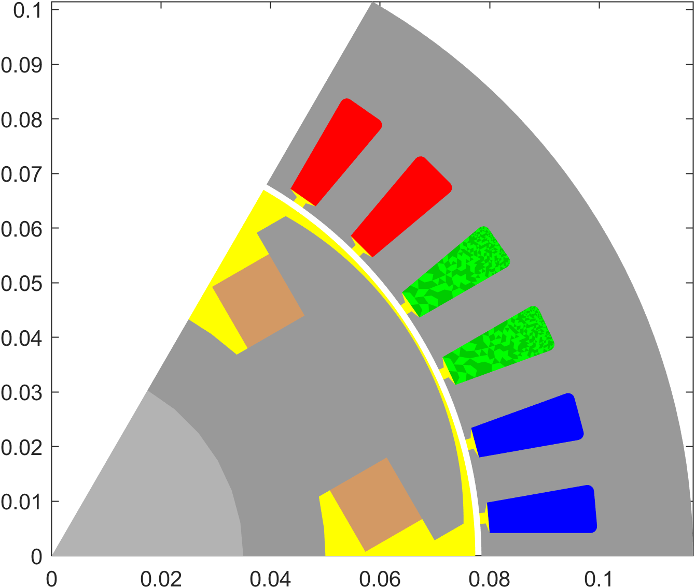
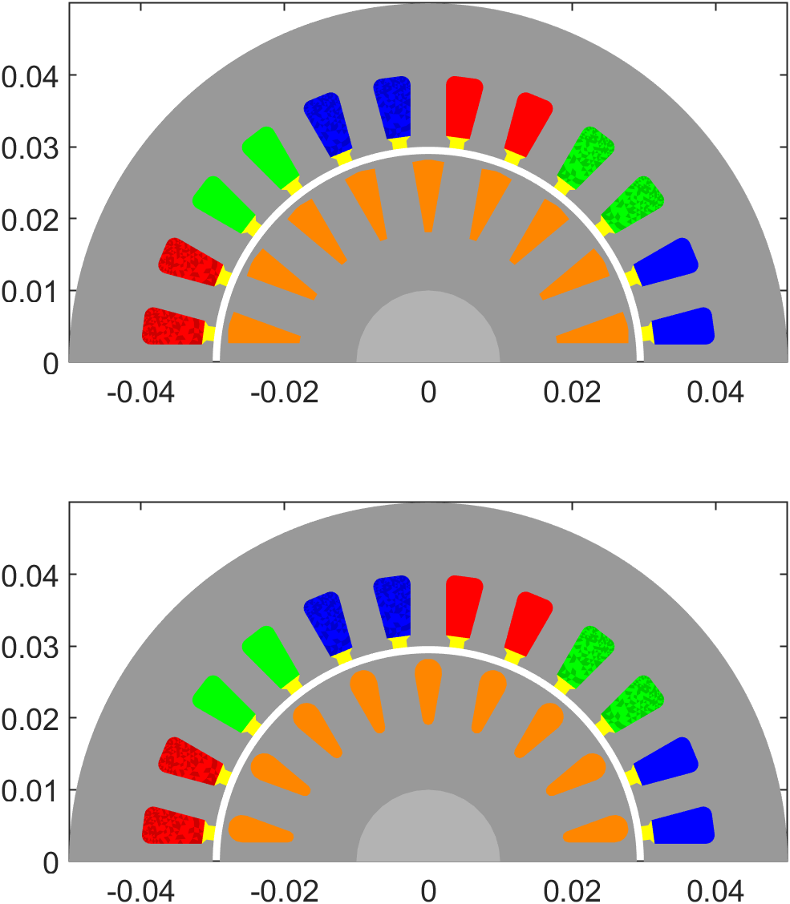
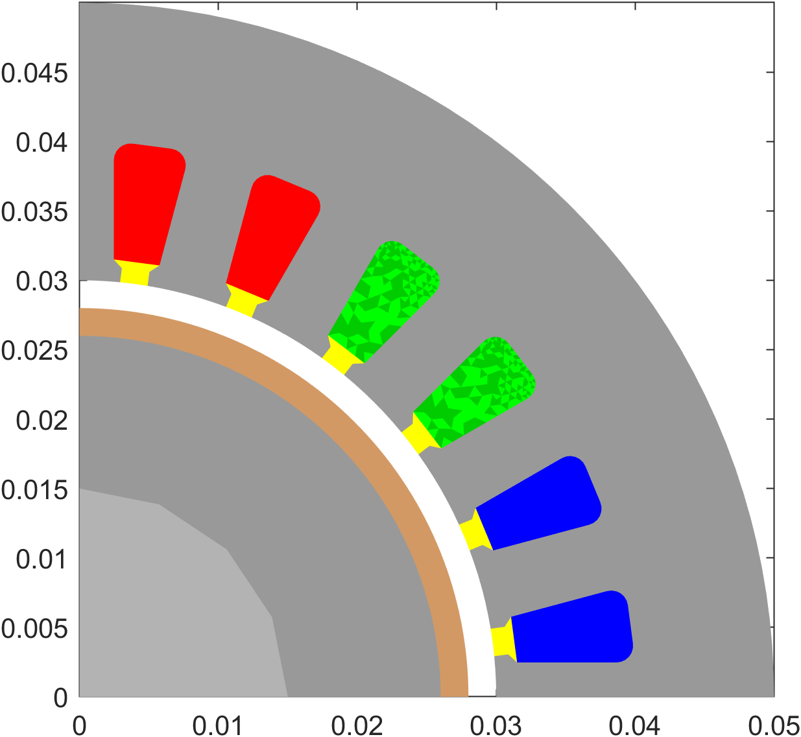

# Overview of popular `EMDtool` geometry templates

This page lists some popular stator and rotor templates.

# Stators

## Stator

The one stator template to rule them all, the [`Stator`](../../api/Stator.html) is the main template for typical radial-flux machine stator geometries. It supports, among other things

* Inrunner and outrunner geometries

* Single and double-layer windings

* Radial and circumferential winding layer directions (i.e. concentrated and distributed-style winding layers)

## LinearStator

Simple linear-machine style stator template, suitable for 2D sliced models of axial flux machines.

# Rotors

## SPM1

A [surface-PM rotor](../../api/SPM1.html) template with arc magnets. Supports:
 * inrunner and outrunner geometries
 * retaining sleeves
 * axially and circumferentially segmented magnets
 * Halbach arrays
 * custom curvature for the airgap-facing magnet side
 * Cooling holes (experimental)

## BreadloafRotor

[A surface-PM rotor template](../../api/BreadloafRotor.html) with breadloaf magnets, i.e. arced airgap face and a straight core-facing side. Supports

* Retaining sleeves
* Axially segmented magnets

## ShieldedSPM

Surface-PM rotor with eddy-current shield.

## VIPM1

A basic [traction-style IPM rotor](../../api/VIPM1.html) template. Supports axial slicing of magnets.

## ClassicIPM

[Template for a  classic / high-speed IPM rotor](../../api/ClassicIPM.html) with the magnet mounted along a straight line, in each pole.

## HSIPM

[Template for a high-speed style IPM rotor](../../api/HSIPM.html) with rectangular magnets embedded in a radial pattern.

## FWRotor1

Template for [a rotor with field winding](../../api/FWRotor1.html).

## SlottedRotor1

[Slotted rotor template](../../api/SlottedRotor1.html) for induction machines. Supports arbitrary slot shapes by giving a [`RotorSlotBase`](../../api/RotorSlotBase.html) object as an input argument.

## Coated rotor

[Coated rotor template](../../api/CoatedRotor.html) for high-speed induction machines.

