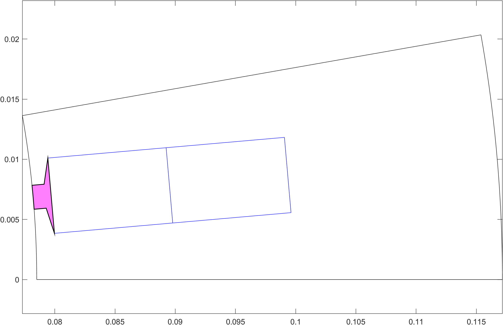
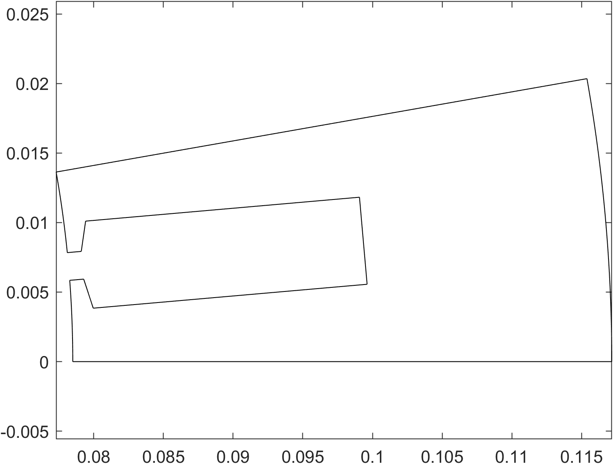

# Slots and Layouts

By now, you are hopefully familiar with `templates` in EMDtool, and understand the concept of stator and rotor templates. However, there are in addition a few optional convenience templates - slots and layouts.

The idea behind the Template-Slot-Layout workflow can best be understood by considering the following physical separation, using a stator as an example:
* On the 'outermost' level, we have the stator core, possibly a housing, cooling channels or slits, and similar
* Inside (or cutting into the) stator, we have slots, typically consisting of a slot opening, a possible slot wedge, and liner if modelled
* Inside the slot we have 'winding window', a so-far free volume of space that the winding goes into. This winding may consist of round wires, rectangular bars or hairpins, or special (e.g. hollow) conductors, which
may be explicitly modelled as solid conductors, or as infinitely-stranded equivalent conductors with a uniform current density.

The division of responsibilities inside `EMDtool` - if the Slot-Layout workflow is used - reflects this:
* The parent template - commonly a [`Stator`](../../api/Stator.html) or e.g. [`SlottedRotor1`](../../api/SlottedRotor1.html) - creates e.g. segment (slot-pitch sized) of the geometry **outside** the slot, creating
all the necessary [`Domains`](../../api/Domain.html), [`Materials`](../../api/MaterialBase.html), and [`Circuits`](../../api/CircuitBase.html).
* The [`Slot`](../../api/SlotShapeBase.html) template creates the slot geometry, also letting the parent template know where the slot joins the airgap (see below). The slot template creates (and adds into the 
parent template) all the materials and domains, with the following caveats:
	* Subclasses of the [`WoundSlot`](../../api/WoundSlot.html) class **do not** create Domains or Materials for the _winding window surfaces_ - only the corresponding 
	[`Surfaces`](../../api/Surface.html) are created and then later to be populated later by a Layout object (see next bullet).
	* Other Slot classes may create the entire slot geometry, and cannot be used in the Slot-Layout workflow.
* The [`Layout`](../../api/WindingLayoutBase.html) template is then used to finalize everything inside the winding window surfaces described above:
	* Creating and adding to the parent geometry all the Materials required for the conductors, insulators, etc.
	* Creating all the surfaces for the conductors, if any, and adding them as [`holes`](../../api/Surface.html#add_hole-add-one-or-more-holes-to-the-surface) to the winding window surfaces
	* Creating the required Domains and [`Conductors`](../../api/Conductor.html) and adding them to the parent geometry and corresponding [`Circuit`](../../api/CircuitBase.html), respectively.

## Benefits of the workflow

Why the multiple layers of confusion, you might be asking? Why not simply create the entire slot and winding geometry inside
the parent template?

This is certainly possible - everything can be made manually if needed. Furthermore, for weird one-off slot shapes that ~should not exist~
do not deserve their own template, EMDtool offers the [`SlotShapeWrapper`](../../api/SlotShapeWrapper.html) class. This class acts as a
_wrapper_ around manually-made slot shapes, allowing one to then populate the slot with a `Layout` class. In other words, it should be
used with one-off slot shapes that need to be combined with different winding models and types.

The benefits of the full Slot-Layout workflow are all about reusability of code and mix-and-matching different models:
* Using any slot shape with any parent geometry (rotors, stators, special stators, etc)
* Using any winding model (infinitely stranded, round wires, rectangular bars, special conductors, either explicitly meshed or 
with AC losses computed with post-processing approaches...)

Of course, there can be practical limitations to the above - for instance most bar-conductor layouts would probably require a roughly-rectangular
slot. 

# Example of the workflow

