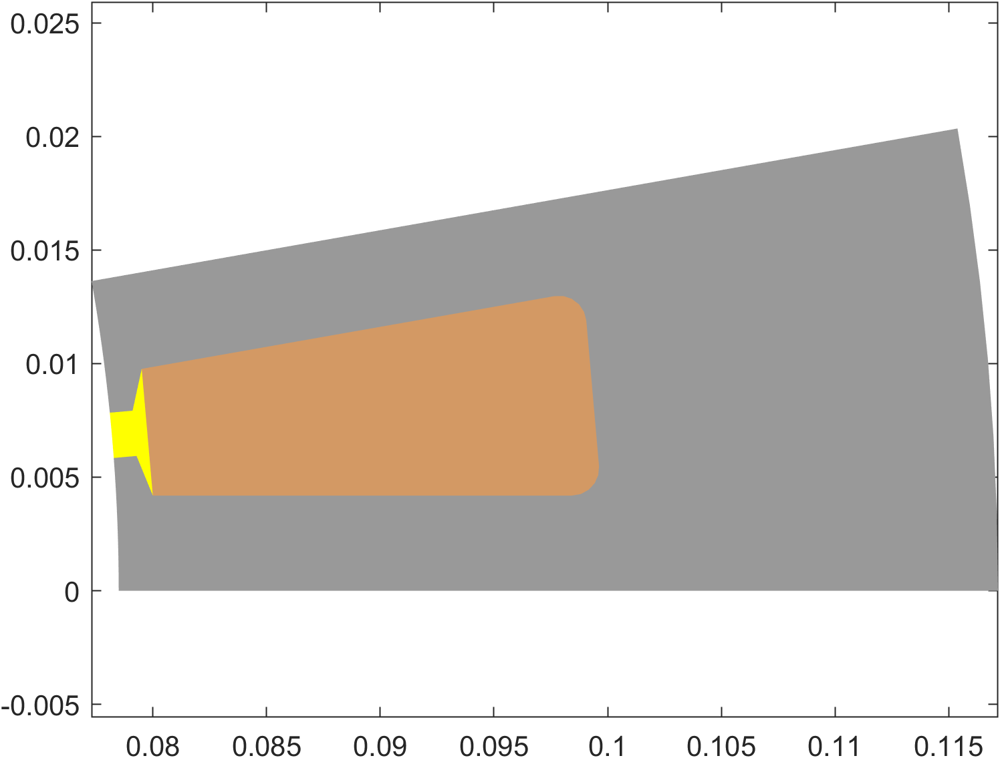
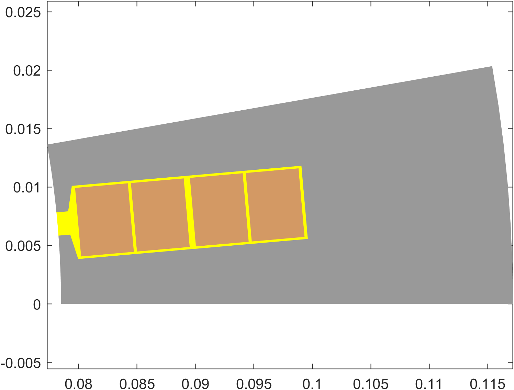
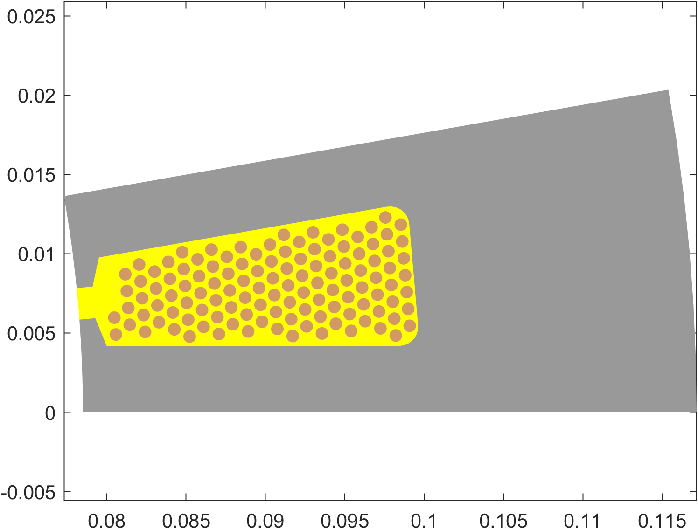

# Slots and Layouts

By now, you are hopefully familiar with `templates` in EMDtool, and understand the concept of stator and rotor templates. However, there are in addition a few optional convenience templates - slots and layouts.

The idea behind the Template-Slot-Layout workflow can best be understood by considering the following physical separation, using a stator as an example:
* On the 'outermost' level, we have the stator core, possibly a housing, cooling channels or slits, and similar
* Inside (or cutting into the) stator, we have slots, typically consisting of a slot opening, a possible slot wedge, and liner if modelled
* Inside the slot we have 'winding window', a so-far free volume of space that the winding goes into. This winding may consist of round wires, rectangular bars or hairpins, or special (e.g. hollow) conductors, which
may be explicitly modelled as solid conductors, or as infinitely-stranded equivalent conductors with a uniform current density.

The division of responsibilities inside `EMDtool` - if the Slot-Layout workflow is used - reflects this:
* The parent template - commonly a [`Stator`](../../api/Stator.html) or e.g. [`SlottedRotor1`](../../api/SlottedRotor1.html) - creates e.g. segment (slot-pitch sized) of the geometry **outside** the slot, creating
all the necessary [`Domains`](../../api/Domain.html), [`Materials`](../../api/MaterialBase.html), and [`Circuits`](../../api/CircuitBase.html).
* The [`Slot`](../../api/SlotShapeBase.html) template creates the slot geometry, also letting the parent template know where the slot joins the airgap (see below). The slot template creates (and adds into the 
parent template) all the materials and domains, with the following caveats:
	* Subclasses of the [`WoundSlot`](../../api/WoundSlot.html) class **do not** create Domains or Materials for the _winding window surfaces_ - only the corresponding 
	[`Surfaces`](../../api/Surface.html) are created and then later to be populated later by a Layout object (see next bullet).
	* Other Slot classes may create the entire slot geometry, and cannot be used in the Slot-Layout workflow.
* The [`Layout`](../../api/WindingLayoutBase.html) template is then used to finalize everything inside the winding window surfaces described above:
	* Creating and adding to the parent geometry all the Materials required for the conductors, insulators, etc.
	* Creating all the surfaces for the conductors, if any, and adding them as [`holes`](../../api/Surface.html#add_hole-add-one-or-more-holes-to-the-surface) to the winding window surfaces
	* Creating the required Domains and [`Conductors`](../../api/Conductor.html) and adding them to the parent geometry and corresponding [`Circuit`](../../api/CircuitBase.html), respectively.

## Benefits of the workflow

Why the multiple layers of confusion, you might be asking? Why not simply create the entire slot and winding geometry inside
the parent template?

This is certainly possible - everything can be made manually if needed. Furthermore, for weird one-off slot shapes that ~~should not exist~~
do not deserve their own template, EMDtool offers the [`SlotShapeWrapper`](../../api/SlotShapeWrapper.html) class. This class acts as a
_wrapper_ around manually-made slot shapes, allowing one to then populate the slot with a `Layout` class. In other words, it should be
used with one-off slot shapes that need to be combined with different winding models and types.

The benefits of the full Slot-Layout workflow are all about reusability of code and mix-and-matching different models:
* Using any slot shape with any parent geometry (rotors, stators, special stators, etc)
* Using any winding model (infinitely stranded, round wires, rectangular bars, special conductors, either explicitly meshed or 
with AC losses computed with post-processing approaches...)

Of course, there can be practical limitations to the above - for instance most bar-conductor layouts would probably require a roughly-rectangular
slot. 

# Example of the workflow

Now, let us use an example to see what happens underneath the workflow, step by step. We'll be using the versatile [`Stator`](../../api/Stator.html) class as the parent geometry, and the 
[`Slot1`](../../api/Slot1.html) shape. Let's begin.

First, the parent geometry performs the required initializations for the Materials and similar, and also initializes the `Slot` object if needed. Note that the core segment Surface is **not yet created**. Instead,
the parent geometry next calls the `.create_geometry` of the slot object.

## Slot geometry is created

The slot object then creates the slot geometry, as seen below. In this case, the slot geometry consists of two distinctly different parts:
* The slot opening `Domain`, illustrated with the filled magenta patch. The slot opening has its own `Material`, which is added to the parent geometry using the [`.create_and_add_material`](../../api/GeoBase.html) method
to avoid creating duplicate materials.
* The two winding window surfaces, illustrated with the blue line. As the `Slot1` class is a subclass of the [`WoundSlot`](../../api/WoundSlot.html) class and therefore intended for the full Slot-Layout workflow,
**no domains or materials** are created for the winding windows.


## Slot is added to the parent geometry

At this point, the execution returns to the parent geometry, and the Surface for the core segment is created. In particular, there are two subcases as for how things can work:
* The slot is completely closed
* The slot has an opening, i.e. joins the airgap

### The slot is closed

In the case of a closed slot - meaning none of the Surfaces created by the Slot object touch the airgap - things are extremely simple.

Indeed, the Surface for the stator core (or whatever is created by the parent geometry) is created completely independently of the slot. An example of the core surface is shown below.


Next, the slot surfaces are then added as `holes` to the parent geometry.

```matlab
core_surface.add_hole(Slot.add_surfaces);
```

### The slot has an opening

If the slot does have an opening - whether an actual physical opening, or just a virtual 'opening' surface consisting of the same material as the parent core - things are a little more complex. Namely, for now, 
`EMDtool` cannot handle intersections of Lines and Arcs.

Meaning, part of the airgap-facing Arcs (or Lines) have already been created by the Slot object, and the creation of the parent core Surface must reflect this. Long story short, 
an example implementation is shown below:

```matlab
core_surface.add_curve(geo.arc, Xin_ccw, O, Slot.last_airgap_point, 'n_ag');
core_surface.add_curve(fliplr(Slot.airgap_surface_curves));
core_surface.add_curve(geo.arc, Slot.first_airgap_point, O, Xin_cw, 'n_ag');
```

The picture below illustrates this, with:
* `Slot.first_airgap_point` highlighted with the red circle
* `Slot.airgap_surface_curves` highlighted with the red arcs
* `Slot.last_airgap_point` highlighted with the red cross

Finally, in this case the `core_surface` is defined as a counter-clockwise polygon; hence the the last airgap point being added first, and the flipping of the slot airgap curve order.


## Winding layout is created

At this point, the Slot object has done its duty, and we move on to the Layout part of the workflow.

As you may remember, the responsibility of the Layout class is to create all the winding-related Surfaces, Domains, and associated Conductors.

In any case, this is triggered by the parent geometry calling the `.create_slot_geometry` method of the [winding specification object](../../api/PolyphaseWindingSpec.html). The `specification` object
is originally created by the user, and contains as a property the [`Layout`](../../api/WindingLayoutBase.html) object used, so in practice the `specification` object simply passes on the execution to the
identically-named method of the Layout object.

Control of the layout and windind model type is provided by the two properties of the `specification`:
* `specification.layout_spec` defines the winding layout. (This is the `Layout` object.)
* `specification.winding_model_type` defines whether the winding is modelled as solid, stranded, or something else.

Now, what exactly happens next of course depends on the particular layout used, but there are still a few common cases.

### Stranded winding

The default behaviour is modelling the entire winding as _stranded_. To do this, the `winding_model_type` of the winding specification is left to its default value `defs.stranded`.

On the theoretical level, this means that the conductors in the model are assumed to carry an uniform current density. The conductor-associated AC losses may then be postprocessed by the `compute_losses_stranded`
method of the layout object. The default `layout_spec` is a the [`UniformLayout`](../../api/UniformLayout.html), which assumes an infinitely stranded winding with no AC losses, but many other Layout templates
(such as the [`RoundWireLayout`](../../api/RoundWireLayout.html) and [`RectangularLayout`](../../api/RectangularLayout.html)) do offer custom AC loss postprocessing methods.

Regarding the geometry creation within the `create_slot_geometry` method, not much happens. Domains are created to house the winding window Surfaces and added to the parent geometry, as is the winding material.



### Solid hairpin winding

To create a model with solid rectangular conductors, the [`RectangularLayout`](../../api/RectangularLayout.html) class can be used:

```matlab
winding.winding_model_type = defs.solid;

layout = RectangularLayout();
layout.conductor_width = dim.wslot_s - 400e-6;
layout.conductor_height = (dim.hslot_s-dim.htt_s)/4 - 400e-6;

winding.layout_spec = layout;
````



### Solid random winding

To create a model with solid round wires, the [`RoundWireLayout`](../../api/RoundWireLayout.html) class can be used:

```matlab
layout = RoundWireLayout();
layout.diameter = 0.8e-3;
winding.wires_in_hand = 10;

winding.layout_spec = layout;
```




